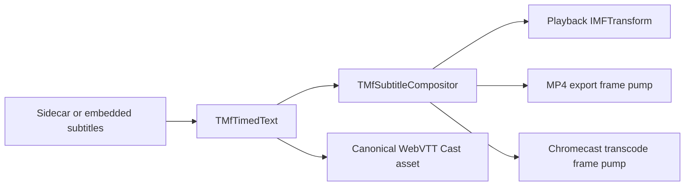
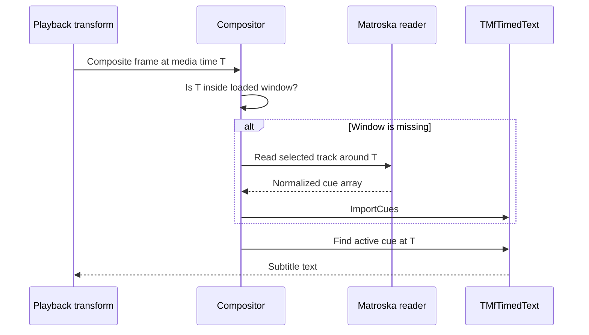
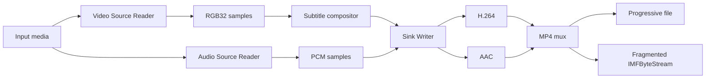
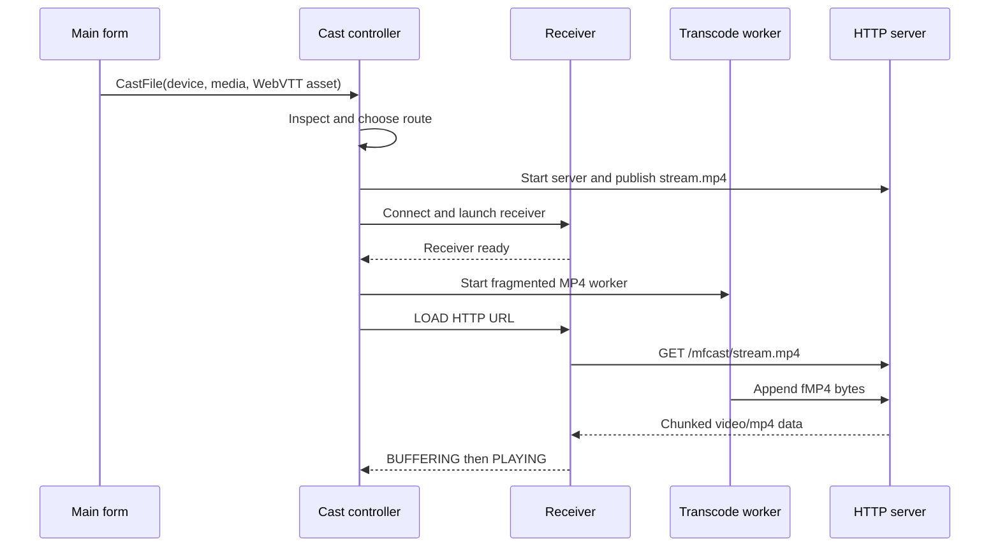

# MfPlayer X2 Architecture and Chromecast Integration

**Project:** MfPack Samples - MfPlayer X2  
**Document status:** Implementation reference  
**Document date:** 9 August 2026  
**Primary language:** Delphi Object Pascal  
**Current SDK baseline:** Windows SDK 10.0.26100.4654

This document describes the implementation in the current MfPlayer X2 source
tree. It is intentionally implementation-focused: names, flows, limitations,
and lifecycle rules should be updated whenever the code changes.

---

## 1. Architectural Summary

MfPlayer X2 extends the original Media Foundation player sample with a shared
subtitle pipeline and a native Chromecast sender.

The central design decision is that subtitle meaning is independent from its
destination:



The application has five cooperating layers:

1. VCL user interface and application lifecycle.
2. Media Foundation Media Session playback.
3. Timed-text discovery, loading, timing, and RGB32 composition.
4. Source Reader and Sink Writer export/transcoding.
5. Chromecast discovery, control, HTTP publication, and route selection.

---

## 2. Source Map

### Application and playback

| Unit | Responsibility |
|---|---|
| `frmMfPlayer.pas` | Main form, player controls, subtitle selection, export, Cast integration, GUI diagnostics |
| `MfPlayerClassX.pas` | Media Session player, topology construction, stream selection, playback state, subtitle facade |
| `MfMediaTimeline.pas` | Stable subtitle timing from sample timestamps, frame rate, or presentation clock |
| `MFTimerCallBackClass.pas` | Media Foundation timer callback support |
| `MfPCXConstants.pas` | Application messages and shared constants |
| `dlgStreamSelect.pas` | Audio/video stream selection dialog |
| `dlgSelectTimedTextLanguages.pas` | Sidecar and embedded subtitle selection dialog |

### Subtitle and export pipeline

| Unit | Responsibility |
|---|---|
| `LangTags.pas` | Language tags, locale/geography helpers, and sidecar discovery |
| `TimedTextClass.pas` | SubRip, MicroDVD, and WebVTT parsing; normalized cue ownership; WebVTT export |
| `MfMatroskaSubtitleReader.pas` | Direct EBML parsing of Matroska subtitle metadata and cues |
| `MfEmbeddedSubtitleReader.pas` | Container-neutral subtitle track enumeration and cue import |
| `MfSubtitleCompositor.pas` | Subtitle source selection, rolling MKV windows, text rendering, RGB32 blending |
| `MfSubtitleTransform.pas` | Synchronous in-place subtitle `IMFTransform` used by local playback |
| `MfSubtitleFramePump.pas` | Source Reader to compositor to H.264/AAC Sink Writer pipeline |

### Chromecast subsystem

| Unit | Responsibility |
|---|---|
| `ChromeCast/MfCastTypes.pas` | Cast records, settings, states, modes, and callbacks |
| `ChromeCast/MfCastInterfaces.pas` | Interfaces between Cast components |
| `ChromeCast/MfCastDiscovery.pas` | IPv4 mDNS/DNS-SD discovery of `_googlecast._tcp.local` |
| `ChromeCast/MfCastTransport.pas` | TCP and SChannel TLS transport to port 8009 |
| `ChromeCast/MfCastChannel.pas` | Cast V2 framing, namespaces, receiver launch, LOAD, commands, and status parsing |
| `ChromeCast/MfCastHttpServer.pas` | Local HTTP server, static resources, range requests, and growing live content |
| `ChromeCast/MfCastMedia.pas` | Media inspection, capability profile, and route planning |
| `ChromeCast/MfCastTranscode.pas` | Worker that feeds fragmented MP4 into the live publisher |
| `ChromeCast/MfCastController.pas` | Cast orchestration, state, rollback, and cleanup |
| `ChromeCast/dlgMfCastDevices.pas` | Device selection and discovery UI |

---

## 3. Local Playback

### 3.1 Open and topology flow

`TMfPlayerX.OpenURL` creates a Media Source and Presentation Descriptor, loads
subtitle metadata, and builds a Media Foundation topology.

Topology construction corrects unreliable source defaults:

- unsupported metadata and data streams are deselected;
- a usable audio stream is selected when none was initially selected;
- a usable video stream is selected when none was initially selected;
- only selected audio and video streams receive renderer branches.

Audio is connected to the Media Foundation audio renderer. Video is connected
to the Enhanced Video Renderer (EVR).

When subtitles are active, the video path is:


Media Foundation may insert the decoder and converter because the topology
allows decoder insertion around the custom transform.

### 3.2 Player states and requests

`TPlayerState` describes the asynchronous Media Session lifecycle, including
opening, starting, pausing, seeking, stopping, and closing. `TRequest` records
the command currently being completed.

Media Session callbacks run outside the VCL thread. UI completion is delivered
through application messages. In particular, `MESessionEnded` posts the final
playback notification only after queued samples have drained. The form then
runs `CompletePlayback`.

### 3.3 End-of-playback behavior

Natural local completion and receiver `IDLE/FINISHED` both converge on
`Tfrm_MfPlayer.CompletePlayback`.

That method:

- clears pending local/Cast synchronization;
- disconnects an active Cast session;
- stops the Cast transcode worker and HTTP server through controller cleanup;
- stops local playback when it has not already stopped;
- resets controls and progress state.

Manual Stop remains a separate explicit-stop path and is not treated as a
natural end-of-file event.

---

## 4. Subtitle Architecture

### 4.1 Supported sources

The active textual formats are:

- SubRip (`.srt`);
- MicroDVD (`.sub`);
- WebVTT (`.vtt`);
- Matroska UTF-8/SRT text;
- Matroska SSA/ASS text.

PGS and VobSub tracks can be identified but are not decoded because they are
bitmap subtitle formats.

The Microsoft MP4 source commonly hides embedded `tx3g`, `wvtt`, and `stpp`
tracks. Those formats require a dedicated MP4 container adapter and are not
claimed as supported embedded text in the current implementation.

### 4.2 Sidecar selection

`TLanguageTags` discovers matching files and derives language metadata from
filename conventions and Windows locale information. Geography and locale
helpers remain available for choosing a suitable default language.

Sidecars are preferred when a supported matching file exists. The language
dialog combines sidecar choices with enumerated embedded tracks.

### 4.3 Normalized cue ownership

`TMfTimedText` is the owner of parsed and imported cues. Container readers do
not expose a separate rendering model; they normalize cue timestamps and text,
then call `ImportCues`.

This keeps lookup, rendering, export, and Cast behavior consistent.

WebVTT is validated and exported as UTF-8 with a `WEBVTT` header. 
Cast subtitle assets use WebVTT only.

### 4.4 Matroska metadata and rolling cue loading

Matroska track discovery uses a direct EBML metadata pass. This is faster and
more complete than relying only on a Presentation Descriptor, which may omit
deselected subtitle tracks.

Selecting an MKV text track does not synchronously import the entire movie.
The compositor activates an empty timed-text model and fills it on demand:

- 30 seconds of look-behind;
- 5 minutes of look-ahead;
- 30 seconds of cluster overlap while scanning EBML clusters.



The rolling read currently occurs synchronously at a window boundary. It
avoids the large startup cost of full extraction, but a slow disk or damaged
container can still delay the frame that triggers a new window.

### 4.5 Operations requiring a complete cue set

`EnsureFullEmbeddedTrack` promotes a rolling MKV track to a complete import
when an operation needs immutable subtitle bytes. This includes canonical
WebVTT export used to prepare a Cast subtitle asset.

Consequently:

- local MKV playback uses rolling windows;
- normal frame lookup does not preload the entire subtitle track;
- WebVTT export and current Cast preparation can perform a full extraction.

### 4.6 Rendering

`TMfSubtitleCompositor` resolves the active cue, builds plain display text,
renders a cached overlay, and blends it into an RGB32 frame. It validates
dimensions, stride, buffer size, and target rectangle.

`TMfSubtitleVideoTransform` is a narrow synchronous one-input/one-output MFT.
It stores one sample, composites during `ProcessOutput`, and returns the same
sample. Optional MFT operations that are irrelevant to this fixed topology may
return `E_NOTIMPL`.

---

## 5. Export and Transcoding

`TMfSubtitleFramePump` is shared by file export and Cast transcoding.



### File export

- produces progressive MP4;
- encodes H.264 video and AAC audio;
- supports video-only sources;
- reports progress;
- supports pause, resume, and cancellation;
- finalizes the Sink Writer when the operation completes or is cancelled after
  frames were written.

### Cast transcode

- uses an injected growing `IMFByteStream`;
- sets the fragmented MP4 container type;
- uses software video decoding for predictable worker behavior;
- rebases output timestamps to zero after a source seek;
- enables real-time pacing;
- publishes H.264/AAC as one growing `video/mp4` resource.

The controller forces `comFragmentedMp4` for the active Cast transcode route,
even though HLS-oriented settings and enum values still exist.

---

## 6. Chromecast Architecture

### 6.1 Discovery

`TMfCastMdnsDiscovery` sends an IPv4 mDNS query for
`_googlecast._tcp.local`, parses PTR/SRV/A/TXT records, merges device records,
and reports additions, updates, and removals through callbacks.

The device dialog owns no Cast transport. It temporarily installs observer
callbacks on the controller and restores the previous callbacks when it closes.

### 6.2 Control transport

`TMfCastTcpTransport` connects to the receiver, normally on port 8009, and
performs a native SChannel TLS handshake. Cast messages are length-prefixed
protobuf-style envelopes containing namespace-specific JSON.

The channel handles:

- connection namespace setup;
- heartbeat PING/PONG messages encountered while reading;
- Default Media Receiver launch (`CC1AD845`);
- media `LOAD`;
- play, pause, stop, seek, volume, and mute;
- receiver and media status parsing;
- stale media status filtering by content URL.

Receiver launch and command completion use bounded synchronous read loops.
There is not yet a dedicated persistent receive/heartbeat worker for all
unsolicited status traffic.

### 6.3 Route selection

The planner chooses among:

- `cmmDirectFile`;
- `cmmDirectWithTextTrack`;
- `cmmTranscodeBurnedSubtitles`.

Automatic selection uses the inspected MIME/container data and a device
profile. If content, video, and audio are allowed, the source is published
directly. An active subtitle asset becomes an external WebVTT track unless the
caller explicitly requests burn-in.

If the media is not allowed, the planner chooses H.264/AAC transcoding and
burns subtitles when an active asset exists.

The main form currently forces MP4 files with active subtitles through the
burned-subtitle transcode route. This avoids relying on embedded MP4 text-track
behavior that the native source does not expose reliably.

### 6.4 Direct route

For direct playback, the HTTP server publishes the source file and supports:

- `GET`;
- `HEAD`;
- byte ranges and `206 Partial Content`;
- content length and MIME type;
- optional CORS headers.

For an external subtitle route, the active cue model is serialized to canonical
UTF-8 WebVTT and published from memory. Each Cast load receives a fresh query
token and track ID to avoid receiver-side caching from an earlier session.

### 6.5 Transcoded route

The transcode route creates the live publication before receiver launch but
starts the worker only after the receiver is ready. This prevents an offline
receiver from leaving an encoder writing into an abandoned presentation.

The receiver receives a buffered `video/mp4` URL. While the presentation is
incomplete, the HTTP server responds with chunked transfer encoding and waits
for additional bytes from the live buffer.



### 6.6 Local HTTP address

The server binds to `0.0.0.0` and normally requests an ephemeral port. The
advertised IPv4 address is selected by creating a route toward the chosen
receiver and querying the resulting local socket address. This avoids exposing
network configuration in the normal GUI.

### 6.7 Firewall diagnostic

Cast control is outbound from the PC, but media delivery requires an inbound
connection from the receiver to the local HTTP server. A common failure is:

- Cast command succeeds;
- receiver remains `BUFFERING`;
- transcode bytes continue accumulating;
- no HTTP request reaches MfPlayer.

The HTTP server records accepted requests. If Cast remains buffering for 15
seconds with zero HTTP requests, the GUI shows a one-time warning explaining
that Windows Firewall or a Public network profile may be blocking
`TMFPlayerX2.exe`.

The watchdog stops when a request arrives, playback starts, casting stops, or
an error occurs. It does not warn for ordinary buffering after the receiver has
already contacted the server.

---

## 7. Cast State and Synchronization

The controller state machine is:

```text
Idle -> Preparing media -> Connecting -> Launching receiver
     -> Connected -> Buffering -> Playing <-> Paused
     -> Stopping/Stopped or Error
```

The local player is allowed to continue while the receiver starts. On the first
Cast `PLAYING` status, the form compares local and receiver positions and seeks
the local session when required. Transcoded output is rebased to zero, so the
controller adds the source start offset back to receiver status before updating
the application timeline.

The local video remains usable if receiver startup fails or takes too long.

---

## 8. Threading and Ownership

### Main thread

- owns VCL controls and dialogs;
- starts subtitle-load and export workers;
- receives player completion messages;
- presents Cast state, errors, and firewall warnings.

### Media Foundation callback threads

- deliver Media Session events;
- update player state;
- post UI notifications instead of directly running completion UI.

### Subtitle-load worker

- imports selected non-rolling tracks away from the VCL thread;
- supports cancellation and serial numbers so stale results are ignored.

### Export and Cast workers

- initialize COM for the worker thread;
- own their compositor and frame pump;
- observe pause/cancel state;
- complete or abort their publisher before release.

### HTTP server thread

- accepts receiver connections;
- parses one request at a time;
- streams static or growing content;
- is released by closing both listening and active client sockets.

Live buffers, HTTP content, byte streams, publishers, and controller components
are interface-owned. Cleanup aborts the publisher before waiting for the
transcode worker, ensuring a blocked byte-stream write can exit.

---

## 9. Failure and Cleanup Rules

Cast setup is transactional. `FailCastAttempt` converts semantic failure such
as `S_FALSE` into an actual failure code, tears down partial work, reports the
stage, and leaves the controller in a recoverable state.

Cleanup order matters:

1. Stop the receiver while its session and media URL are still valid.
2. Abort the live publisher to release blocked writes.
3. Stop and join the transcode worker.
4. Unpublish subtitle and media resources.
5. Stop the HTTP server and close the client socket.
6. Disconnect the Cast control channel.
7. Clear pending and active request records.

Repeated casting after an offline receiver or failed load must not reuse an old
publisher, URL, media session, or worker.

---

## 10. Current Boundaries

The following limitations are intentional or not yet completed:

- Media inspection and the default capability profile remain optimistic; a
  compatible extension/MIME type does not prove codec compatibility.
- The Cast channel has bounded command read loops but no always-running receive
  and heartbeat worker.
- The HTTP server handles clients serially rather than through a worker pool.
- Incomplete live MP4 uses HTTP chunked transfer; receiver support can vary.
- HLS settings and output mode exist, but no complete playlist and segment
  publisher is active.
- HTTP TLS is not implemented.
- Resource-token and maximum-connection settings are ahead of the concrete
  server implementation.
- Cast control TLS peer verification is disabled by default.
- Discovery is IPv4 only.
- Runtime switching among multiple Cast text tracks is not implemented.
- Bitmap subtitles such as PGS and VobSub are not decoded.
- Embedded MP4 text requires a dedicated container adapter.
- Full WebVTT asset export currently promotes a rolling MKV track to a complete
  import before Cast startup.

The trust model is a private local network. Media URLs are plain HTTP and must
be reachable from the receiver.

---

## 11. Diagnostics

Useful debug markers include:

```text
Embedded subtitle refresh
MfCast WebVTT cue
MfCast TRANSCODE URL
MfCast Transcode: worker started
Export: first ReadSample
Export: before WriteSample
MfCast live buffer bytes
MfCast HTTP request
MfCast HTTP live chunked start
MfCast MEDIA_STATUS
MfCast receiver STOP
```

Interpretation of a typical live Cast attempt:

- advancing frame counts prove decoding and encoding are active;
- increasing live-buffer bytes prove the Sink Writer is producing fMP4;
- an HTTP request proves the receiver can reach the PC;
- `BUFFERING` without any HTTP request points to firewall or network isolation;
- `PLAYING` confirms receiver demux, decode, and startup;
- `IDLE/FINISHED` triggers complete local and Cast teardown.

Errors should include both the hexadecimal HRESULT and the operation stage.

---

## 12. Build and Runtime Requirements

- Windows 10 version 1703 or later, or Windows 11.
- Delphi with the MfPack units configured; current source headers target
  compiler versions 23 through 35.
- Windows SDK 10.0.26100.4654.
- Media Foundation decoders for the source format.
- H.264 and AAC encoders for export and transcoded Cast playback.
- Receiver and PC on a mutually reachable local network.
- Windows Firewall permission for the application on the active network
  profile.

Open `TMFPlayerX2.dproj`, select Win32, and build from the Delphi IDE. The
installed Delphi edition used during current development does not support
command-line compilation.

---

## 13. Regression Checklist

### Local playback

- audio/video, video-only, and audio-only sources;
- play, pause, resume, seek, rate, stop, and natural completion;
- close during opening, playback, seek, and shutdown;
- verify that natural completion also disconnects an active Cast session.

### Subtitles

- SRT, MicroDVD, and WebVTT sidecars;
- MKV UTF-8/SRT and SSA/ASS tracks;
- multiple languages and asynchronous selection;
- rolling-window transition and seek to a distant timestamp;
- malformed WebVTT header;
- PGS/VobSub reported as unsupported rather than parsed as text.

### Export

- H.264/AAC output and video-only output;
- pause, resume, cancel, and finalization;
- long-duration A/V synchronization;
- VLC playback of the resulting MP4 with burned subtitles.

### Chromecast

- direct file and range requests;
- external WebVTT text track;
- burned-subtitle fragmented MP4;
- start from a nonzero local position;
- pause, resume, seek, stop, and natural completion;
- repeated Cast attempts after failure;
- receiver powered off or disconnected;
- Public network/firewall block and the 15-second GUI warning;
- application close during live transcode;
- verify that no worker, listening socket, or stale URL remains.

---

## 14. Architectural Invariants

When modifying the application, preserve these rules:

1. `TMfTimedText` remains the normalized cue owner.
2. Container readers return normalized cues and do not render subtitles.
3. Playback, export, and Cast burn-in share `TMfSubtitleCompositor`.
4. Cast networking receives immutable subtitle bytes, not live player objects.
5. Rolling MKV reads are used for ordinary playback; complete export is
   explicit.
6. VCL controls are touched only from the main thread.
7. Publisher abort precedes worker join during teardown.
8. A failed Cast attempt leaves no worker, resource, socket, or stale request.
9. Local or receiver end-of-file tears down both sides of an active Cast.
10. User-facing networking remains automatic, with actionable diagnostics when
    automatic setup is blocked.

---

## 15. Final Perspective

MfPlayer X2 is a compact reference for joining Media Foundation playback,
timed text, frame composition, MP4 encoding, and Google Cast without duplicating
subtitle logic.

The subtitle parser decides what text is active. The timeline decides when it
is active. The compositor decides how it becomes pixels. The playback MFT,
file exporter, and Cast transcoder decide where those pixels go.

The Chromecast subsystem follows the same separation: discovery, transport,
protocol, HTTP publication, media planning, transcoding, and GUI observation
are distinct components coordinated by `TMfCastController`.

That separation is the main architectural asset. Future work should strengthen
capability inspection, persistent Cast status reception, HTTP concurrency and
security, and truly incremental Cast subtitle delivery without weakening the
shared cue and compositor model.

<EOF>
