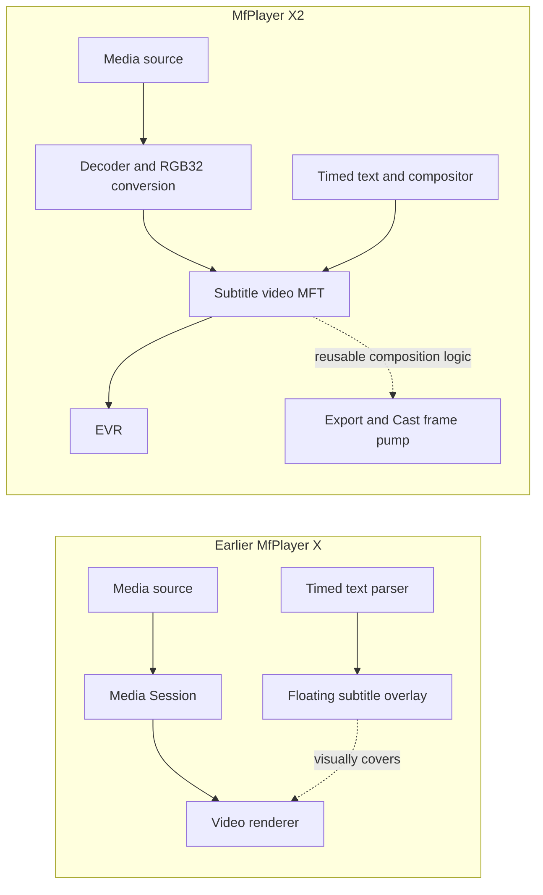
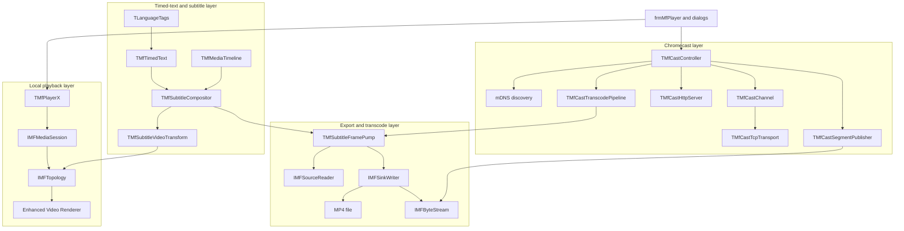
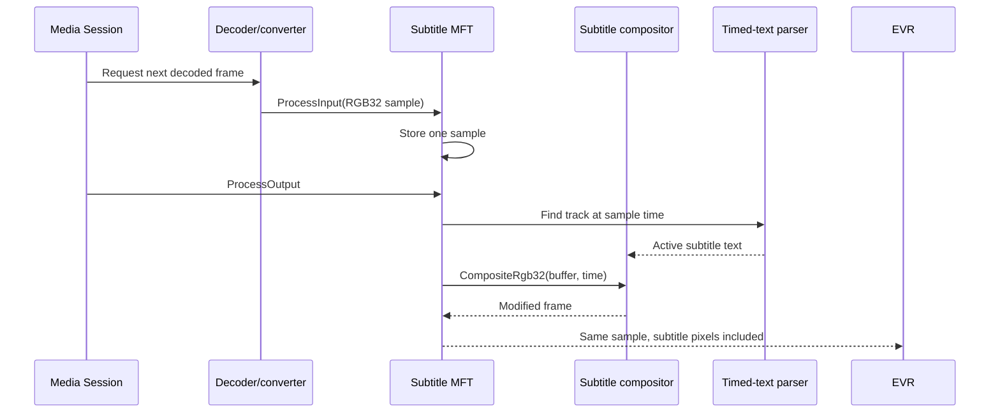
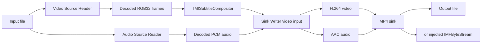
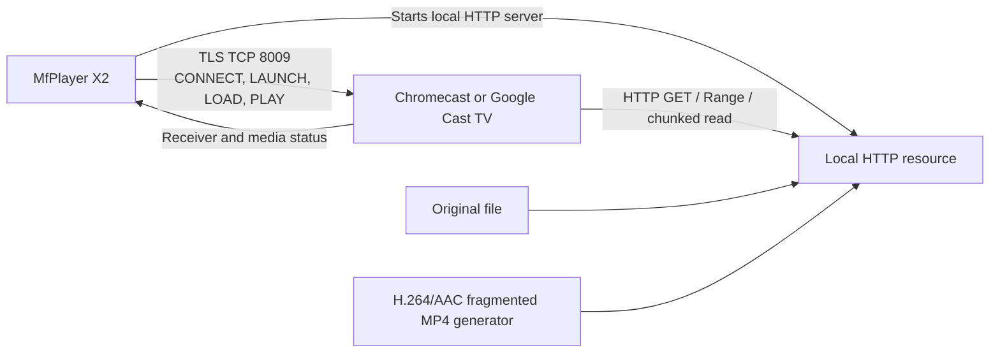
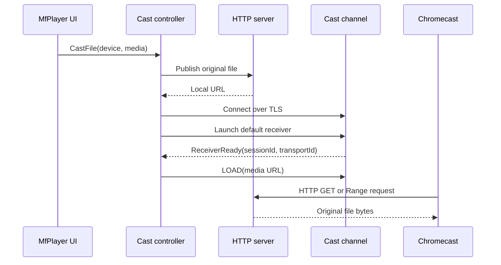
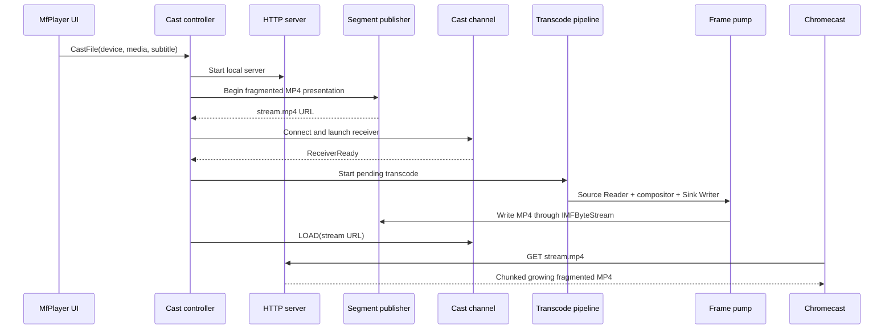
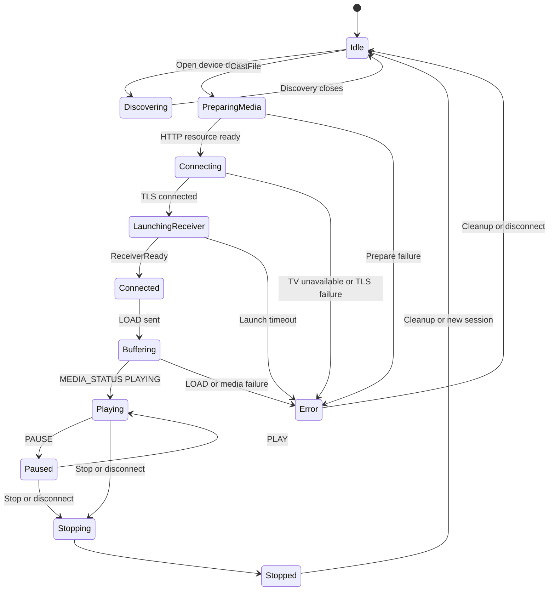
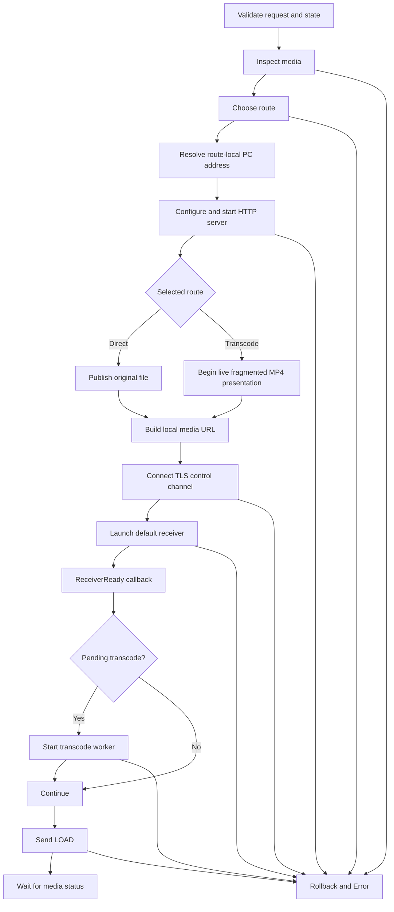

# MfPlayer X2 Architecture and Chromecast Integration

**Project:** MfPack Samples - MfPlayer X2  
**Document status:** Architecture and implementation reference  
**Source snapshot:** `MfPlayer_X2_update_2_cast_tv_off_fix.zip`  
**Document date:** 30 July 2026  
**Primary language:** Delphi Object Pascal  
**Intended compiler baseline:** Delphi XE7 and later, including Delphi 12  
**Intended operating systems:** Windows 10 1703 or later and Windows 11  
**MfPack SDK baseline:** Windows SDK 10.0.26100.4654

> This document describes the supplied source tree as it exists in the source snapshot above. Some older README files in the project describe an earlier skeleton state and are no longer technically accurate. Those differences are called out explicitly.

---

## 1. Purpose of this document

MfPlayer X2 is no longer only a small revision of the earlier MfPlayer X sample. It has become a reference implementation for several related Media Foundation workflows:

- local Media Foundation playback;
- timed-text discovery, selection, parsing, and rendering;
- subtitle burn-in during live playback through a custom Media Foundation Transform;
- subtitle burn-in during export through a Source Reader and Sink Writer pipeline;
- H.264 and AAC MP4 generation;
- writing MP4 output to either a file or an `IMFByteStream`;
- Google Cast device discovery and control;
- local HTTP publication of direct files or generated media;
- automatic route selection between direct casting and transcoding;
- defensive shutdown, lifetime management, and rollback after failed Cast attempts.

The document has four main goals:

1. Explain what changed between MfPlayer X and MfPlayer X2.
2. Explain the architecture and runtime flow of MfPlayer X2.
3. Describe every important unit, with extra detail for the `ChromeCast` directory.
4. Record implementation limits, technical risks, and follow-up work that are easy to overlook while the code is still evolving.

---

## 2. Source and terminology notes

### 2.1 What can be stated about the earlier MfPlayer X

The complete old MfPlayer X source is not included in the supplied X2 ZIP. The comparison in this document is therefore based on:

- the official MfPack project description of MfPlayer X;
- comments and transition notes in the current X2 source;
- the current root `readme.md`;
- the architecture visible in the current X2 implementation.

The public MfPack description presents MfPlayer X as a Media Foundation sample that demonstrates:

- `IMFTimer`;
- language tags;
- subtitles in SubRip, MicroDVD, and WebVTT formats;
- regular-expression based parsing;
- media properties.

Project reference:

- <https://github.com/FactoryXCode/MfPack>

Statements about the exact internal layout of the old overlay form should be treated as architectural history, not as a line-by-line audit of the old source.

### 2.2 Naming

The source uses both `ChromeCast` and `Chromecast`. Google's product spelling is **Chromecast**, while many identifiers and directory names use `ChromeCast`. Renaming public Pascal identifiers is not required, but user-facing text and documentation should ideally use one spelling consistently.

### 2.3 MfPlayer X2 keeps the class name `TMfPlayerX`

The main player class in `MfPlayerClassX.pas` is still called `TMfPlayerX`. The project and executable are named MfPlayer X2, but the class name was retained for compatibility and to avoid a large mechanical rename.

---

## 3. Executive summary: MfPlayer X versus MfPlayer X2

The core architectural change is that subtitles are no longer treated as a separate visual window floating above the video. In X2, subtitle text enters the actual video-frame pipeline.

That change unlocks three outcomes from one compositor:

- subtitles can appear in local playback;
- the same subtitles can be permanently burned into an exported MP4;
- the same export machinery can feed a live `IMFByteStream` for casting.

### 3.1 High-level comparison

| Area | Earlier MfPlayer X | MfPlayer X2 |
|---|---|---|
| Playback engine | Media Foundation Media Session player | Media Foundation Media Session player with revised topology construction and shutdown handling |
| Subtitle display | Separate floating subtitle overlay in the earlier design | Subtitle pixels are composed into RGB32 video frames |
| Subtitle timing | Timer and timed-text lookup associated with display overlay | Sample timestamps first, with frame-rate and clock fallback through `TMfMediaTimeline` |
| Playback subtitle path | GUI overlay | Custom synchronous in-place `IMFTransform` inserted before the EVR |
| Export | Not the central design goal | Source Reader to RGB32 compositor to Sink Writer, producing H.264 and AAC MP4 |
| Reuse of subtitle renderer | Primarily playback display | Shared by playback transform, export, and Cast transcode pipeline |
| Output target | Local player | Local player, MP4 file, or injected `IMFByteStream` |
| Stream selection | Traditional source selection | Corrects initially deselected audio/video streams and ignores metadata/data streams |
| Casting | Not part of the earlier sample | mDNS discovery, Cast V2 control channel, local HTTP server, direct file route, transcode route |
| Network setup | Not applicable | Automatic local-interface and ephemeral-port selection, hidden from normal users |
| Failure handling | Player-oriented | Transactional Cast rollback, offline-device handling, worker shutdown, publisher cleanup |
| Lifetime model | Legacy ownership patterns | More explicit COM/interface ownership and cleanup after Media Session shutdown |
| Debugging | Sample diagnostics | MadExcept, `OutputDebugString`, HRESULT staging, state-aware GUI controls |

### 3.2 The conceptual shift



In the earlier model, subtitle rendering and video rendering were neighboring systems. In X2, subtitle rendering is part of the video data path itself.

---

## 4. Design goals of MfPlayer X2

### 4.1 Primary goals

- Keep the Media Foundation Session based local player.
- Reuse the existing timed-text parser and language-tag logic.
- Remove dependence on a floating subtitle form.
- Use one subtitle compositor for playback, export, recording, and streaming.
- Preserve original media files unless the user explicitly exports or transcodes.
- Prefer direct Chromecast playback when the source is compatible.
- Use H.264 and AAC transcoding with burned subtitles as the fallback route.
- Keep normal-user Cast interaction as simple as choosing a device.
- Keep network addresses, listening ports, and transport settings automatic.
- Retain Delphi XE7 compatibility.
- Use callbacks and worker threads rather than GUI timers for media processing.
- Ensure shutdown is deterministic and leak-free.

### 4.2 Non-goals in the current snapshot

The current source is not yet a complete general-purpose Cast SDK. In particular, it does not yet provide:

- complete device-specific codec negotiation;
- a persistent Cast receive and heartbeat loop;
- complete external WebVTT track publication and Cast JSON serialization;
- a complete HLS manifest and rolling-fragment publisher;
- a hardened multi-client HTTP server;
- certificate pinning or full peer validation;
- a full JSON parser;
- IPv6 mDNS discovery;
- every optional `IMFTransform` method.

These are development boundaries, not reasons to discard the architecture. The current design has clear interfaces where those functions can be added.

---

## 5. Top-level architecture

MfPlayer X2 is composed of five cooperating layers:

1. **VCL application layer**  
   Menus, forms, dialogs, status display, export commands, and lifecycle management.

2. **Local player layer**  
   Media Foundation Media Session, topology building, playback commands, stream selection, EVR integration, and clock services.

3. **Timed-text and composition layer**  
   Subtitle-file discovery, parser, language selection, timeline, and RGB32 composition.

4. **Export/transcode layer**  
   Source Readers, Sink Writer, H.264 and AAC output, file or byte-stream destination, worker cancellation, and progress.

5. **Chromecast layer**  
   Device discovery, TLS control transport, Cast V2 messages, HTTP serving, media route planning, and orchestration.



---

## 6. How local playback works

### 6.1 Player creation and open flow

The VCL form creates or retrieves a `TMfPlayerX` instance. When a file is opened, the player:

1. creates or reuses a Media Foundation Media Session;
2. creates a Media Source for the URL or file;
3. obtains a Presentation Descriptor;
4. loads or reloads timed text;
5. builds an X2 playback topology;
6. submits the topology to the Media Session;
7. waits for Media Session topology events;
8. starts playback when requested.

The public state machine is represented by `TPlayerState`:

- `Closed`
- `Ready`
- `OpenPending`
- `Starting`
- `Started`
- `Pausing`
- `Paused`
- `Stopping`
- `Stopped`
- `Closing`
- `Seeking`
- `SeekingReady`
- `TopologyReady`

A separate `TRequest` enumeration tracks pending commands such as start, stop, pause, seek, close, rate, capture, and snapshot.

### 6.2 Correcting stream selection

`CreatePlaybackTopologyX2` does more than blindly accept the source's initial stream-selection state.

The code:

- enumerates all stream descriptors;
- deselects selected streams that are neither audio nor video;
- selects a default audio stream if none is selected;
- selects a default video stream if none is selected;
- creates topology branches only for corrected selected streams.

This is important for files where a source initially selects metadata, subtitle, or data streams while leaving audio or video deselected.

### 6.3 Building topology branches

`AddBranchToPlaybackTopologyX2` creates the appropriate renderer branch:

- audio streams are connected to the Media Foundation audio renderer;
- video streams are connected to the Enhanced Video Renderer;
- unsupported selected streams are deselected instead of causing an invalid topology.

When timed text is loaded and enabled, the video branch becomes:


The transform node uses `MF_CONNECT_ALLOW_DECODER`, allowing Media Foundation to insert a decoder or converter before the custom transform. The EVR output node also allows conversion when needed.

Without loaded subtitles, the source connects directly to the renderer path and the custom MFT is omitted.

### 6.4 Playback event processing

`TMfPlayerX` implements `IMFAsyncCallback`. Media Session events arrive on Media Foundation callback threads and are interpreted by methods such as:

- topology-status handling;
- session started, paused, stopped, closed, and ended handling;
- error propagation;
- pending command execution;
- clock and rate service acquisition.

Late topology callbacks are guarded during shutdown through the application-closing state. This prevents helper objects such as presentation-clock sinks and timer callbacks from being recreated while the player is being destroyed.

---

## 7. Subtitle architecture

### 7.1 Subtitle discovery and language tags

`LangTags.pas` contains `TLanguageTags`, which associates timed-text files with the current media by filename and language-tag conventions. It resolves language and country information and helps select an appropriate subtitle source.

Examples of expected sidecar naming can include a base media name followed by a language or locale marker. The exact matching behavior is implemented in `TLanguageTags` and used by `TMfTimedText` and the compositor.

### 7.2 Timed-text parsing

`TimedTextClass.pas` contains:

- `TMfTimedText`
- `TSubTitleTrack`
- `TFormattedText`
- timed-text format identifiers

The current practical formats are:

- SubRip, usually `.srt`;
- MicroDVD, usually `.sub`;
- WebVTT, usually `.vtt`.

The type enumeration also contains YouTube and SAMI values, but project constants and comments indicate those formats are reserved or not fully implemented.

The parser is responsible for:

- reading the timed-text file;
- constructing tracks with start and end times;
- retaining language and formatting metadata;
- finding the subtitle active at a requested media time.

Some text-color and text-background-color parsing remains incomplete, so styling should not yet be described as fully standards-compliant.

### 7.3 Media timeline

`TMfMediaTimeline` provides a stable media-time value when input samples do not always carry usable timestamps.

Its time-source preference is:

1. sample timestamp;
2. frame-rate derived progression;
3. wall-clock progression.

The class also handles:

- start;
- pause;
- resume;
- stop;
- seek;
- playback rate;
- frame-rate configuration.

This prevents subtitle placement from depending on a single fragile clock source.

### 7.4 Subtitle compositor

`TMfSubtitleCompositor` owns the timed-text object and performs two related tasks:

1. determine which subtitle text belongs to the requested media time;
2. render and blend that text into an RGB32 video frame.

The compositor:

- opens the appropriate timed-text file;
- selects a preferred language where available;
- retrieves the active subtitle track;
- builds plain display text;
- calculates a target rectangle that respects video size and subtitle aspect ratio;
- renders text through GDI-compatible drawing structures;
- blends the rendered subtitle pixels into the RGB32 destination.

The composition code validates:

- width and height;
- stride;
- buffer size;
- output rectangle;
- media timestamp.

### 7.5 Playback transform

`TMfSubtitleVideoTransform` is a synchronous, one-input, one-output Media Foundation Transform.

Key properties:

- derives from `TInterfacedObject` so Media Foundation interface references control its lifetime correctly;
- implements `IMFTransform`;
- implements the custom `IMfSubtitleVideoTransformControl` interface;
- accepts RGB32 media types;
- operates in place on an `IMFSample`;
- buffers one input sample;
- calls the compositor during `ProcessOutput`;
- returns the same sample after composition;
- can be enabled or disabled without rebuilding all subtitle state.

Several optional or unnecessary MFT methods return `E_NOTIMPL`, including stream-ID customization, per-stream attributes, dynamic stream insertion, output bounds, and event processing. This is acceptable for the deliberately narrow synchronous topology, but any future use in a different Media Foundation host may require broader implementation.

### 7.6 Subtitle playback data flow



---

## 8. Export and transcode architecture

### 8.1 Frame pump

`TMfSubtitleFramePump` is the reusable offline or streaming conversion engine.

It performs this pipeline:



### 8.2 Video path

The video Source Reader is configured to provide RGB32 output. Each sample is:

- timestamped or assigned fallback timing;
- locked and validated;
- vertically corrected when required;
- passed through `CompositeRgb32`;
- written to the Sink Writer.

The output video subtype is H.264.

### 8.3 Audio path

A separate audio Source Reader obtains decoded audio. The Sink Writer encodes it as AAC and interleaves it with the video stream.

This separation allows audio samples to be drained according to video progression while preserving independent Media Foundation stream handling.

### 8.4 Output targets

`BurnSubtitlesToFile` accepts both:

- an output filename;
- an optional `IMFByteStream`.

This makes the same frame pump usable for:

- conventional file export;
- a generated live stream published by the Cast HTTP server.

The boolean fragmented-MP4 option selects an MP4 mode suitable for progressive generation through a byte stream. A conventional MP4 may require final metadata at the end of the file, while fragmented MP4 can emit independently useful fragments as encoding progresses.

### 8.5 Cancellation and pause

The frame pump supports:

- cancel;
- pause;
- resume;
- progress callbacks;
- Source Reader and Sink Writer flushing during cancellation;
- retry handling for temporarily unwritable output.

`TMfSubtitleExportThread` in `frmMfPlayer.pas` hosts file export outside the VCL thread and initializes COM as multithreaded.

---

## 9. Application and GUI integration

### 9.1 Main form

`frmMfPlayer.pas` is the integration point for:

- local player creation and commands;
- open, close, play, pause, stop, and seek;
- stream-selection dialog;
- timed-text language dialogs;
- subtitle export thread;
- Cast component creation;
- Cast callback handling;
- menu-state and status-bar synchronization;
- application shutdown.

The form intentionally owns orchestration and UI policy, while the Cast controller and media classes remain GUI-independent.

### 9.2 Cast component construction

During `FormCreate`, the main form constructs a `TMfCastComponents` dependency bundle containing:

- `TMfCastMdnsDiscovery`;
- `TMfCastChannel` with `TMfCastTcpTransport`;
- `TMfCastHttpServer`;
- `TMfCastMediaInspector`;
- `TMfCastCapabilityResolver`;
- `TMfCastMediaPlanner`;
- `TMfCastSegmentPublisher`;
- `TMfCastTranscodePipeline`.

The bundle is injected into `TMfCastController`. The controller is then configured with `TMfCastSettings.CreateDefault` and connected to VCL callbacks.

This is preferable to having the controller create all concrete classes internally because:

- implementations can be replaced;
- testing doubles can be injected;
- network, media, and GUI concerns remain separated;
- ownership boundaries are visible.

### 9.3 Cast menu behavior

The main Cast menu contains actions for:

- Cast To;
- Stop Casting;
- Pause Casting;
- Resume Casting.

`UpdateCastControls` derives enablement from the controller state. A new `Cast To` operation is blocked while a Cast attempt or session is active.

After a successful `CastFile` call, the form can start local playback to keep the application display synchronized with the casting workflow. Chromecast-reported status remains authoritative for Cast controls.

### 9.4 Current subtitle integration gap in the form

The current `mnuCastToClick` sets:

```pascal
SubtitleSourceName := '';
```

The transcode worker can still let the compositor discover a language-tagged sidecar based on the media filename. However, the form is not yet explicitly passing the currently selected timed-text file and language into the Cast request.

That should be corrected when the application's current subtitle-selection state is exposed cleanly.

### 9.5 Shutdown

The close sequence is deliberately defensive:

1. cancel active export and postpone form closing until the worker exits;
2. mark the player as closing;
3. disconnect and release the Cast controller;
4. shut down the Media Session;
5. wait for `MESessionClosed`;
6. call `Shutdown` on source and session;
7. release topology and services;
8. clear player-owned callback, clock, subtitle, and helper objects;
9. free the player.

Recent leak work is important architectural knowledge:

- `TMfSubtitleVideoTransform` must be interface-owned;
- the Media Session must be shut down before its final release;
- `ClearSession` and object cleanup must not depend on an asynchronous `Stop` state changing immediately;
- presentation-clock helpers must not be recreated by late topology callbacks;
- `BeforeDestruction` performs both shutdown and local helper cleanup.

---

## 10. Root directory unit guide

### 10.1 `TMFPlayerX2.dpr`

The application entry point.

Responsibilities:

- includes MadExcept support;
- enables Delphi's fallback memory-leak reporting in debug builds when MadExcept is absent;
- registers all local player, subtitle, export, and Cast units;
- creates the main form and modal support dialogs;
- starts the VCL message loop.

### 10.2 `frmMfPlayer.pas` and `frmMfPlayer.dfm`

The main VCL application form.

Responsibilities:

- player commands and display;
- menu and toolbar state;
- media-file selection;
- local position, duration, volume, and rate UI;
- stream and subtitle selection;
- export-thread lifecycle;
- Cast initialization and callbacks;
- application close coordination.

This form should remain the UI integration layer. Network protocol internals do not belong here.

### 10.3 `MfPlayerClassX.pas`

The main Media Foundation player engine.

Responsibilities:

- Media Session creation;
- Media Source creation;
- presentation and stream selection;
- topology construction;
- audio and video renderer branches;
- custom subtitle-transform insertion;
- Media Session callback handling;
- presentation clock and timer services;
- playback state machine;
- play, pause, stop, seek, rate, and volume control;
- snapshot and video-mixer support;
- subtitle compositor and transform ownership;
- export entry point;
- deterministic session shutdown.

Despite the X2 project name, the class remains `TMfPlayerX`.

### 10.4 `MfMediaTimelineX2.pas`

A timestamp fallback and playback-time helper.

Responsibilities:

- sample-time tracking;
- frame-rate derived time;
- wall-clock fallback;
- rate-aware progression;
- pause, resume, seek, and stop state.

### 10.5 `MfSubtitleCompositorX2.pas`

Shared subtitle lookup and pixel-composition engine.

Responsibilities:

- opens timed text;
- selects a track and language;
- calculates active subtitle text at a media time;
- calculates the target subtitle area;
- draws and blends text into RGB32 frames.

### 10.6 `MfSubtitleTransformX2.pas`

The playback-side custom MFT.

Responsibilities:

- accepts and outputs RGB32;
- stores one input sample;
- calls the compositor;
- returns the modified sample;
- exposes an enabled property through a custom interface;
- obeys Media Foundation interface lifetime rules.

### 10.7 `MfSubtitleFramePumpX2.pas`

The export and Cast transcode engine.

Responsibilities:

- video Source Reader;
- audio Source Reader;
- RGB32 subtitle composition;
- H.264 output;
- AAC output;
- MP4 Sink Writer;
- output to file or `IMFByteStream`;
- fragmented MP4 selection;
- cancellation, pause, resume, and progress.

### 10.8 `TimedTextClass.pas`

Timed-text parser and track model.

Responsibilities:

- parse supported subtitle formats;
- store subtitle tracks;
- represent formatted text;
- return active text by timestamp;
- retain timing and language information.

### 10.9 `LangTags.pas`

Language-tag and sidecar-file helper.

Responsibilities:

- find timed-text files associated with media;
- interpret locale and language tags;
- resolve user and system language information;
- assist default subtitle selection.

### 10.10 `MFTimerCallBackClass.pas`

Media Foundation timer callback helper.

Responsibilities:

- implement `IMFAsyncCallback`;
- interact with the presentation clock and Media Foundation timer;
- post timer notifications back to the player window;
- cancel pending timer work during destruction.

This helper is part of player timing and notification. It is not the frame-processing clock used to write subtitle pixels.

### 10.11 `UniThreadTimer.pas`

A general threaded timer component.

Responsibilities:

- host timer work outside the VCL main thread;
- provide a component-style wrapper around a timer thread.

Any future cleanup should confirm whether both this timer and the Media Foundation timer callback are still required, or whether their duties can be consolidated.

### 10.12 `MfPCXConstants.pas`

Shared constants for the player sample, including timed-text file extensions and format-related values.

### 10.13 `dlgStreamSelect.pas` and `.dfm`

Modal stream-selection interface for source audio and video streams.

### 10.14 `dlgSelectTimedTextLanguages.pas` and `.dfm`

Timed-text language-selection form.

### 10.15 `dlgTimedTextLanguages.pas` and `.dfm`

A second timed-text language form with overlapping naming and responsibilities.

These two similarly named language-dialog units are a maintenance risk. They should be reviewed and either clearly differentiated or consolidated.

---

## 11. Chromecast system overview

A Chromecast session has two separate network paths:

1. **Control path**  
   MfPlayer X2 connects to the Cast device over TLS, normally on TCP port 8009. It sends Cast V2 protobuf-envelope messages containing JSON commands.

2. **Media path**  
   Chromecast connects back to the local HTTP server hosted by MfPlayer X2. It fetches either the original file or generated MP4 bytes.

This distinction is essential. The PC does not normally push the media through the Cast control socket.



### 11.1 Why no normal-user network controls are needed

When a device is selected, the controller determines the correct local interface automatically:

1. resolve the selected device address;
2. create a UDP socket;
3. logically connect that socket to the device;
4. call `getsockname`;
5. use the local address Windows selected for that route;
6. start the HTTP server on an automatic port when `ListenPort` is zero;
7. advertise the resulting URL to the Cast receiver.

No UDP media packet needs to be sent. Windows routing selects the correct local interface.

Example internal result:

```text
http://192.168.1.25:49172/mfcast/media.mp4
```

The user should only need to choose a screen.

---

## 12. Chromecast operating modes

### 12.1 Direct file

Used when the planner considers the source compatible.



Advantages:

- low CPU usage;
- immediate seeking when range requests are used;
- no quality loss;
- no generated-media buffer.

Current caveat: compatibility is inferred mainly from filename extension and MIME type, not from actual decoded codec properties.

### 12.2 Direct file with external text track

The data model supports:

- `TMfCastTrackInfo`;
- `Tracks` in `TMfCastLoadRequest`;
- `ActiveTrackIds`;
- external subtitle mode.

However, the current implementation does not yet:

- convert and publish the selected subtitle as WebVTT;
- add the track JSON to the Cast `LOAD` message;
- activate the chosen text track;
- make the media inspector report sidecar timed text.

Therefore this route is architectural scaffolding, not a finished feature.

### 12.3 Transcode with burned subtitles

Used as the universal fallback or when explicitly selected.



A critical correction in the current source is that transcoding starts only after `ReceiverReady`. If the TV is off or unreachable, no worker is left writing into a presentation that a later attempt may replace.

---

## 13. Chromecast state machine

`TMfCastState` contains:

- `csIdle`
- `csDiscovering`
- `csConnecting`
- `csConnected`
- `csLaunchingReceiver`
- `csPreparingMedia`
- `csBuffering`
- `csPlaying`
- `csPaused`
- `csStopping`
- `csStopped`
- `csError`

A normal cast follows approximately:



### 13.1 Transactional failure rollback

A Cast attempt owns several resources that must be treated as one transaction:

- transcode worker;
- publisher and live byte stream;
- HTTP resource;
- Cast channel;
- HTTP listening socket;
- pending load and transcode requests;
- selected device and media state.

`CleanupCastAttempt` releases these in a deliberate order:

1. stop and join the writer worker;
2. abort the live presentation;
3. unpublish a direct-file resource;
4. disconnect the Cast channel;
5. stop the HTTP server;
6. clear pending requests and state records.

This order prevents a worker from writing into a released buffer.

`FailCastAttempt` also handles `S_FALSE` specially. Although `S_FALSE` is numerically a successful HRESULT, it means the requested Cast operation did not complete and is converted to a timeout-style failure.

---

## 14. Detailed guide to the `ChromeCast` directory

## 14.1 `MfCastTypes.pas`

This unit contains shared data structures and defaults. It has no VCL dependency.

### Main enumerations

- `TMfCastLogLevel`
- `TMfCastState`
- `TMfCastMediaMode`
- `TMfCastSubtitleMode`
- `TMfCastOutputMode`
- `TMfCastStreamType`

### Main records

- `TMfCastDevice`  
  Discovered device identity, friendly name, model, host, address, port, raw capabilities, TXT records, and last-seen time.

- `TMfCastMediaInfo`  
  Source, title, content type, container, duration, live/seekable flags, stream presence, timed-text presence, codec subtypes, dimensions, rates, bitrates, and audio properties.

- `TMfCastDeviceProfile`  
  Allowed MIME types and codecs, size/rate/bitrate limits, and unknown-format policy.

- `TMfCastLoadRequest`  
  URL, MIME type, stream type, title, start time, autoplay, text tracks, and active track IDs.

- `TMfCastMediaStatus`  
  Receiver media-session ID, player state, idle reason, position, duration, volume, and mute state.

- `TMfCastErrorInfo`  
  HRESULT plus stage, message, and detail.

- settings records for protocol, discovery, HTTP, and encoding;
- callback records for discovery, channel, and controller;
- `TMfCastTranscodeRequest`.

### Why callback records are used

Callbacks are method-pointer records rather than observer interfaces. This avoids accidental COM-style reference cycles between controller, dialog, channel, and discovery objects.

### Important defaults

Protocol defaults include:

| Setting | Default |
|---|---:|
| mDNS service | `_googlecast._tcp.local` |
| Cast control port | `8009` |
| Default receiver app ID | `CC1AD845` |
| Connect timeout | 5000 ms |
| Read timeout | 3000 ms |
| Write timeout | 5000 ms |
| Receiver launch timeout | 30000 ms |
| Heartbeat interval | 5000 ms |
| Heartbeat timeout | 15000 ms |
| Verify TLS peer | `False` |

Discovery defaults include:

| Setting | Default |
|---|---:|
| Response window | 1500 ms |
| Refresh interval | 30000 ms |
| Device expiry | 120000 ms |
| IPv4 | enabled |
| IPv6 | disabled |

HTTP defaults include:

| Setting | Default |
|---|---:|
| Bind address | `0.0.0.0` |
| Advertised address | automatic |
| Listen port | `0`, automatic ephemeral port |
| Base path | `/mfcast` |
| CORS | enabled |
| Range requests | enabled |
| TLS | disabled |

Encoding defaults include H.264, AAC, 4 Mbps video, 128 kbps audio, 48 kHz stereo, 1920 by 1080 maximum, 30 fps, and configurable segment/fragment timing.

These are program defaults, not controls that a normal user should have to edit.

---

## 14.2 `MfCastInterfaces.pas`

This unit defines the architecture boundaries.

### Interfaces

- `IMfCastLogger`  
  Structured diagnostics abstraction.

- `IMfCastDiscovery`  
  Start, stop, refresh, enumerate devices, configure, and callbacks.

- `IMfCastTransport`  
  Connect, disconnect, send, receive, and connected state.

- `IMfCastChannel`  
  Cast receiver and media commands.

- `IMfCastHttpContent`  
  Random-access or live-readable HTTP resource.

- `IMfCastHttpServer`  
  Configure, start, stop, publish, unpublish, and build URLs.

- `IMfCastSegmentPublisher`  
  Begin, expose byte stream, publish initialization/media fragments, update manifest, complete, and abort.

- `IMfCastMediaInspector`  
  Convert a source name into `TMfCastMediaInfo`.

- `IMfCastCapabilityResolver`  
  Resolve a device profile.

- `IMfCastMediaPlanner`  
  Choose direct, external-track, or transcode route.

- `IMfCastPreviewSink`  
  Abstraction for local preview samples.

- `IMfCastTranscodePipeline`  
  Configure, start, pause, resume, stop, seek, and report state.

- `IMfCastController`  
  GUI-independent orchestration and public Cast API.

These interfaces make it possible to test the controller using fake transports, servers, or discovery implementations.

---

## 14.3 `MfCastDiscovery.pas`

Implements `TMfCastMdnsDiscovery`.

### Network behavior

- uses IPv4 UDP multicast;
- multicast address: `224.0.0.251`;
- port: `5353`;
- queries the configured `_googlecast._tcp.local` service;
- parses PTR, SRV, TXT, and A records;
- understands compressed DNS names;
- extracts friendly-name, model, ID, and capability-style TXT values;
- stores devices in a protected cache;
- issues add, update, and remove callbacks;
- removes devices after the expiry interval.

### Threading behavior

The current `Refresh` operation receives responses synchronously during the configured response window and sleeps briefly between receives. When invoked directly by the dialog, this can block the VCL thread for approximately the response-window duration.

A future version should move refresh receiving to a discovery worker or use asynchronous socket notification.

### Current limits

- IPv4 only in the concrete implementation;
- no full continuous background discovery loop;
- multicast behavior may be affected by VPNs, multiple adapters, or Wi-Fi client isolation.

---

## 14.4 `MfCastTransport.pas`

Implements `TMfCastTcpTransport` using native Windows APIs.

### Responsibilities

- resolve hostnames and IPv4 addresses;
- open a TCP socket;
- apply socket read and write timeouts;
- connect to Cast port 8009;
- perform a TLS client handshake through SChannel;
- encrypt outbound application records;
- decrypt inbound TLS records;
- preserve partial encrypted and decrypted buffers;
- disconnect and release SChannel credentials and context handles.

### Why this design matters

The transport does not depend on:

- VLC internals;
- Indy;
- antique OpenSSL DLLs;
- a third-party protobuf runtime.

It uses WinSock and SChannel, fitting the native Windows and MfPack style.

### Current security status

`VerifyTlsPeer` defaults to `False`. This is convenient for initial Cast-device compatibility but should not be described as strict authenticated TLS.

Future hardening should define:

- whether Chromecast certificates can be validated normally;
- whether device certificate pinning or Cast device-auth messages are required;
- what happens on certificate mismatch;
- whether control-channel authentication is needed for the intended threat model.

TLS renegotiation currently returns `E_NOTIMPL`.

---

## 14.5 `MfCastChannel.pas`

Implements the Cast V2 control channel.

### Message framing

A Cast message consists of:

1. a manually encoded protobuf-style envelope;
2. source and destination IDs;
3. namespace;
4. UTF-8 JSON payload;
5. a four-byte network-order length prefix.

The unit avoids a protobuf dependency by implementing the small field subset required by Cast messages.

### Supported outbound commands

- connection `CONNECT`;
- receiver `LAUNCH`;
- receiver `GET_STATUS`;
- media `LOAD`;
- media `PLAY`;
- media `PAUSE`;
- media `STOP`;
- media `SEEK`;
- receiver volume and mute changes.

### Incoming messages

The channel parses:

- receiver status;
- transport ID and session ID;
- media status;
- media-session ID;
- player state;
- current time and duration;
- idle reason;
- receiver close indications.

The controller maps receiver `PLAYING`, `PAUSED`, `BUFFERING`, `LOADING`, and `IDLE` status to application states.

### Current limits

- the JSON extraction routines are lightweight string parsers, not a full JSON parser;
- there is no permanent receiver thread that continuously drains the TLS socket;
- heartbeat settings exist, but a persistent ping/pong worker is not yet implemented;
- text-track arrays in `TMfCastLoadRequest` are not yet serialized into `LOAD` JSON;
- `LoadMedia` should be reviewed to ensure its wait result is always propagated rather than returning success merely because the command was sent;
- unsolicited media-status changes can only be observed while code is actively receiving messages.

A dedicated channel worker is one of the most important remaining improvements.

---

## 14.6 `MfCastHttpServer.pas`

This is the largest Cast infrastructure unit. It contains both static-file and generated-stream support.

### Main classes and interfaces

#### `IMfCastLiveBuffer` and `TMfCastLiveBuffer`

A reference-counted growing byte buffer used between the Media Foundation Sink Writer and the HTTP reader.

Responsibilities:

- random-position writes;
- position-based reads;
- wait for additional data;
- report length;
- mark complete;
- close or abort;
- discard already consumed leading data in large blocks.

Making the buffer interface-owned is critical. Older raw-pointer ownership allowed a second Cast attempt to free a buffer while an earlier writer still held an `IMFByteStream`, producing a use-after-free exception.

#### `TMfCastLiveByteStream`

An `IMFByteStream` adapter over the live buffer.

Used by the Media Foundation Sink Writer.

It supports:

- length and position;
- synchronous read and write;
- asynchronous write callback pattern;
- seek;
- flush;
- close.

The read-side asynchronous methods remain unimplemented because the current Sink Writer use case writes to the stream.

#### `TMfCastLiveStreamContent`

Exposes the live buffer through `IMfCastHttpContent` so the HTTP server can read generated bytes.

#### `TMfCastFileContent`

Exposes a normal file through `IMfCastHttpContent`.

It opens a file for each positional read with sharing enabled, avoiding a shared mutable `TFileStream.Position` and allowing thread-safe random access.

#### `TMfCastHttpServer`

A native WinSock HTTP server.

Current behavior:

- binds to a configurable local address and port;
- accepts port zero for an ephemeral port;
- publishes content under a base path;
- supports `GET` and `HEAD`;
- supports URL decoding;
- serves complete static content with `Content-Length`;
- supports byte ranges and `206 Partial Content`;
- emits `Accept-Ranges` and `Content-Range` where appropriate;
- can add CORS headers;
- serves incomplete generated content using HTTP/1.1 chunked transfer;
- waits for new live bytes until completion, close, or idle timeout.

Current limits:

- accepted clients are handled serially in the server thread rather than through a worker pool;
- `MaxConnections` is not yet enforced as a true concurrent-connection limit;
- all configured header/read/write timeout fields should be audited because not all are applied to client sockets;
- HTTP TLS mode returns `E_NOTIMPL`;
- the configured resource-token byte count is not yet used to create unguessable URLs;
- the range-request setting should be audited to ensure it gates range processing everywhere;
- there is no mature cache policy or access-control layer.

#### `TMfCastSegmentPublisher`

Bridges generated MP4 output to the HTTP server.

Current implementation:

- creates a live buffer;
- publishes one `stream.mp4` resource;
- exposes an `IMFByteStream` to the Sink Writer;
- marks a presentation complete or aborted;
- unpublishes and releases the presentation safely.

The following methods are still placeholders:

- publish initialization segment;
- publish media fragment;
- update manifest.

Therefore the current transcode path is a single growing fragmented MP4 over chunked HTTP, not a complete HLS implementation despite HLS-oriented interfaces and settings.

---

## 14.7 `MfCastMedia.pas`

Contains media inspection, capability resolution, and route planning.

### `TMfCastMediaInspector`

Current inspection is extension-based. It determines:

- container name;
- MIME type;
- likely audio/video presence;
- whether the source is HTTP and therefore treated as live;
- basic seekability.

It does not yet open the source through Media Foundation to determine:

- actual video codec;
- actual audio codec;
- profile or level;
- dimensions;
- frame rate;
- bitrate;
- audio sample rate and channel count;
- duration;
- sidecar subtitle presence.

`HasTimedText` currently remains false.

### `TMfCastCapabilityResolver`

Returns a configured default profile for every device. It does not yet derive a model-specific profile from Cast model name, capabilities, firmware, or receiver response.

### `TMfCastMediaPlanner`

Chooses between:

- direct file;
- direct file with external track;
- transcode with burned subtitles.

The planner checks allowed MIME types and codec subtype arrays. The current default profile permits unknown formats, making automatic mode deliberately permissive.

A production-quality planner should enforce profile dimensions, frame rate, bitrate, codecs, and subtitle support.

---

## 14.8 `MfCastTranscode.pas`

Adapts `TMfSubtitleFramePump` to the Cast publisher.

### Worker behavior

The worker:

1. initializes COM as multithreaded;
2. creates a subtitle compositor;
3. opens the explicit subtitle source or falls back to sidecar discovery from the media source;
4. creates the frame pump;
5. obtains the publisher's `IMFByteStream`;
6. runs subtitle burn-in and MP4 generation;
7. completes or aborts the presentation;
8. releases pump, compositor, publisher, and COM state.

### Pipeline behavior

`TMfCastTranscodePipeline` supports:

- configure;
- start;
- pause;
- resume;
- stop;
- state reporting.

Stop is synchronous from the controller's perspective:

- request cancellation;
- wait for the worker;
- free the thread object;
- release byte stream and publisher references.

Seek currently returns `E_NOTIMPL`.

The preview-sink interface is retained in the architecture, but the current worker does not push samples into it. Local preview during Cast is therefore controlled separately by the main player, not by the Cast transcode worker.

Only part of `TMfCastEncodingSettings` is currently applied by the frame pump. The active output mode and video bitrate are used, while broader codec, resolution, frame-rate, keyframe, low-latency, and hardware-transform settings need fuller plumbing.

---

## 14.9 `MfCastController.pas`

The controller is the GUI-independent conductor of the Cast system.

### Dependency bundle

`TMfCastComponents` holds interfaces for all cooperating subsystems. The controller does not need to know concrete class internals.

### Main responsibilities

- configure all components;
- start, stop, and refresh discovery;
- forward device callbacks;
- inspect media;
- select a route;
- resolve the correct advertised local IP;
- configure and start HTTP serving;
- publish direct or generated content;
- connect the Cast channel;
- launch the receiver;
- start pending transcoding only after receiver readiness;
- send `LOAD`;
- map media status to controller state;
- play, pause, stop, seek, volume, and mute;
- rollback failed attempts;
- disconnect and release session resources.

### CastFile sequence



### Direct route

`PrepareDirectFile` publishes the original source through `TMfCastFileContent` and builds a `cstBuffered` load request.

The subtitle arguments are currently accepted but not used to publish an external track.

### Transcode route

`PrepareTranscodedStream`:

- copies the current encoding settings;
- forces `comFragmentedMp4` for the current single-resource stream;
- creates the live presentation;
- builds the HTTP URL;
- stores a pending transcode request;
- does not start the worker yet.

`ReceiverReady` starts the worker and then sends `LOAD`.

### Offline-TV correction

The source now avoids this former failure pattern:

```text
Start transcoder
Fail to reach TV
Leave worker active
Start second Cast attempt
Replace buffer
Old worker writes through dangling pointer
```

The corrected pattern is:

```text
Prepare URL
Try to reach and launch TV
If successful, start transcoder
If unsuccessful, rollback everything
```

---

## 14.10 `dlgMfCastDevices.pas` and `.dfm`

A deliberately small VLC-style device picker.

### Visible controls

- device `TListView` with Name and Device columns;
- Refresh button;
- Cast button;
- Cancel button;
- Auto Refresh checkbox;
- read-only status edit.

There are no normal-user controls for:

- network interface;
- IP address;
- HTTP port;
- Cast control port;
- codec;
- bitrate;
- segment duration.

That configuration remains automatic.

### Callback and thread handling

The dialog temporarily augments the controller callbacks and restores the previous callbacks when it closes.

Device callbacks can arrive on a non-VCL thread. The dialog copies callback data into heap records and posts private window messages. The main thread then updates the list and disposes the copied records.

### Current Auto Refresh behavior

The checkbox triggers discovery when the dialog opens or when it is checked. There is no recurring VCL timer or background periodic scheduler in the current dialog, so the caption “Auto Refresh” is stronger than the implemented behavior. Either implement periodic refresh or rename it to something such as “Search automatically when opened.”

---

## 14.11 `README.md`, `README_GUI.md`, and `WIRE_IN_MFPLAYER.txt`

These files were useful during skeleton development but are now partly stale.

Examples:

- `ChromeCast/README.md` says network, HTTP, transcoding, and message processing remain behind `E_NOTIMPL`, but substantial implementations now exist.
- older GUI wiring notes may not include the current controller rollback or interface-owned live buffer;
- construction and event signatures may have changed since the notes were written.

They should be replaced or reduced to links to this document.

---

## 14.12 `ChromeCast/__history`

This directory contains Delphi editor history copies. It is not runtime source and should normally be excluded from:

- release archives;
- source-control commits;
- code reviews;
- compiler search paths.

It can easily confuse audits because obsolete implementations appear beside current units.

---

## 15. Threading model

MfPlayer X2 uses several distinct execution contexts.

| Context | Main responsibilities |
|---|---|
| VCL main thread | Forms, menus, player commands, dialog display, UI status |
| Media Foundation callback threads | Media Session events, topology status, asynchronous callbacks |
| Export thread | File export, MTA COM initialization, frame pump |
| Cast transcode thread | Live frame pump and byte-stream generation |
| HTTP server thread | Accept HTTP clients and serve static or growing resources |
| mDNS caller thread | Current discovery refresh receive loop, often the VCL thread |

### 15.1 Rules

- Never update VCL controls directly from worker or Media Foundation callback threads.
- Marshal device and status callbacks to the main thread.
- Stop and join producer threads before releasing their sinks or buffers.
- Initialize COM correctly in every thread that uses Media Foundation or COM interfaces.
- Do not hold a critical section while invoking external callbacks.
- Treat shutdown callbacks as potentially late.

### 15.2 Current improvement opportunity

Both discovery and Cast-channel receiving would benefit from dedicated workers. The current discovery can briefly block the UI, and the channel does not continuously receive status or heartbeat messages.

---

## 16. Ownership and lifetime model

### 16.1 COM and Media Foundation interfaces

Objects exposed to Media Foundation through interfaces should normally be reference-counted. Examples:

- `TMfSubtitleVideoTransform` derives from `TInterfacedObject`;
- `TMfCastLiveBuffer` is exposed through `IMfCastLiveBuffer`;
- `TMfCastLiveByteStream` derives from `TInterfacedObject`;
- Cast subsystem components are held through interfaces.

### 16.2 Manually owned helpers

Legacy helpers such as the Media Foundation timer callback and clock-state sink use explicit player ownership. Their cleanup must match their inheritance and registration model. A class must not be converted to `TInterfacedObject` while still being freed manually through a raw object pointer unless ownership is redesigned at the same time.

### 16.3 Live-buffer lesson

A producer-consumer object shared through multiple interfaces must not be represented by a raw pointer in one participant and freed by another participant.

The current interface-owned live buffer guarantees:

- an old byte stream keeps its old buffer alive;
- replacing the publisher's current buffer does not invalidate outstanding references;
- a closed buffer returns an error instead of executing through released object memory.

### 16.4 Callback cycles

Method-pointer callback records avoid cycles such as:

```text
Controller interface -> Dialog observer interface -> Controller interface
```

The device dialog still must restore callbacks before releasing its controller reference.

---

## 17. Time units and conversions

The project crosses several time domains.

| Domain | Unit |
|---|---|
| Media Foundation samples and player API | 100 ns units |
| Subtitle text files and parser logic | commonly milliseconds or parsed format units |
| Cast JSON media position | seconds, represented as decimal JSON |
| Windows tick and timeout logic | milliseconds |
| HTTP stream position | byte offsets |

Rules:

- use `MFTIME` or `Int64` for Media Foundation time;
- convert Cast current-time seconds to and from 100 ns at the channel boundary;
- avoid floating-point time accumulation when an integer sample timestamp is available;
- keep byte position and media time as different concepts;
- document every conversion at subsystem boundaries.

---

## 18. Current implementation status

| Feature | Status | Notes |
|---|---|---|
| Media Session local playback | Implemented | Audio/video topology and state machine |
| Correct selected audio/video streams | Implemented | Metadata/data streams are deselected |
| Timed-text parsing | Implemented | SubRip, MicroDVD, WebVTT are the practical formats |
| RGB32 subtitle composition | Implemented | Shared compositor |
| Subtitle MFT in playback topology | Implemented | Synchronous in-place RGB32 transform |
| Burned-subtitle MP4 export | Implemented | H.264 video and AAC audio |
| Export pause/cancel/progress | Implemented | Worker-thread based |
| mDNS discovery | Implemented, IPv4 | Synchronous receive window |
| Native SChannel Cast transport | Implemented | Peer verification disabled by default |
| Cast protobuf envelope | Implemented | Minimal required subset |
| Receiver launch and LOAD | Implemented, synchronous | Needs persistent receive loop review |
| Cast play/pause/stop/seek/volume | Implemented commands | Ongoing status reception is incomplete |
| Direct file HTTP serving | Implemented | GET, HEAD, range support |
| Automatic local route address | Implemented | UDP connect plus `getsockname` |
| Automatic ephemeral HTTP port | Implemented | Listen port zero |
| Live `IMFByteStream` publication | Implemented | Interface-owned growing buffer |
| Fragmented MP4 Cast transcode | Implemented basic route | One growing chunked HTTP resource |
| Offline-TV transactional rollback | Implemented | Prevents orphan worker and stale controls |
| External WebVTT Cast track | Not complete | Data records exist, publication and LOAD JSON missing |
| HLS initialization/fragments/manifest | Placeholder | Publisher methods currently no-op |
| Device-specific capability profile | Not complete | Default profile returned for every device |
| Actual codec inspection | Not complete | Extension/MIME based only |
| Persistent Cast receive worker | Not complete | Needed for heartbeat and spontaneous status |
| HTTP worker pool | Not complete | Client handling is serial |
| HTTP resource tokens | Not complete | Setting exists, path remains predictable |
| Cast HTTP TLS | Not complete | `E_NOTIMPL` |
| IPv6 discovery | Not complete | Setting exists, concrete discovery is IPv4 |
| Cast transcode seek | Not complete | Pipeline returns `E_NOTIMPL` |
| Preview sink in Cast pipeline | Not connected | Local playback is used separately |

---

## 19. Important issues and omissions that should be documented

This section collects matters that are easy to forget because the code may appear to work in the most common test.

### 19.1 Automatic direct-play selection is currently optimistic

An `.mp4` extension does not guarantee Chromecast compatibility. The file could contain an unsupported H.264 profile, HEVC, AV1, unusual AAC parameters, FLAC, or another codec.

The inspector should eventually use Media Foundation to populate `TMfCastMediaInfo`, and the planner should compare real codec properties with a real device profile.

### 19.2 Sidecar subtitles are not yet part of automatic planning

`HasTimedText` remains false in the current media inspector, and the main form passes an empty explicit subtitle source. As a result:

- automatic planning may select direct file even when a subtitle is active locally;
- the external-track route is not selected automatically;
- burned subtitles may only appear when the transcode route is explicitly or otherwise selected.

The currently selected timed-text source and language need to be passed into `CastFile` and into media planning.

### 19.3 External text tracks are a model, not a finished route

The records exist, but publication, WebVTT conversion, JSON `tracks`, and `activeTrackIds` still need implementation.

### 19.4 HLS names do not mean HLS is finished

`comHlsFmp4`, segment duration settings, and publisher methods exist, but the current working path forces fragmented MP4 into one growing resource. The documentation and UI must not claim full HLS support yet.

### 19.5 Persistent Cast channel processing is essential

A robust sender should continuously:

- receive control frames;
- answer heartbeat pings;
- send periodic heartbeat pings if required;
- detect connection loss;
- process unsolicited receiver and media status;
- match responses to request IDs;
- wake waiting commands without making each command own the receive loop.

The current synchronous command-and-wait approach is a useful bring-up implementation but should evolve.

### 19.6 HTTP server settings are ahead of implementation

Several settings already exist as good architectural placeholders, but should be audited and either implemented or labeled reserved:

- resource-token byte count;
- maximum connections;
- all socket timeouts;
- HTTP TLS;
- range enable switch;
- concurrent clients.

### 19.7 Security assumptions must be explicit

The current design assumes a trusted local network.

Risks include:

- predictable unprotected HTTP paths;
- plain HTTP media transfer;
- disabled TLS peer verification on the control channel;
- other LAN clients potentially fetching the resource while it is published.

Before production use, add random resource tokens, minimize publication lifetime, validate peers where practical, and document the trust boundary.

### 19.8 Windows Firewall and network isolation

Even with correct automatic address selection, Chromecast must be able to connect back to the PC.

Common blockers:

- Windows Firewall inbound rule missing;
- Wi-Fi access-point client isolation;
- guest network isolation;
- PC and TV on different VLANs;
- VPN route or multicast interference;
- multiple active network adapters.

The normal user should still not see networking controls. Diagnostics should report a clear reason and useful internal address/port details.

### 19.9 Logger interface is not yet used as the central log

A logger abstraction exists, but current integration relies heavily on `OutputDebugString`. Inject a concrete logger that can write:

- debugger output;
- a bounded diagnostic memo;
- optional rotating log files;
- HRESULT stage and state transitions;
- network endpoints with sensitive tokens redacted.

### 19.10 “Auto Refresh” is not periodic

The Cast dialog currently performs an automatic search, not recurring refresh. Rename or implement a worker-driven refresh interval.

### 19.11 Old READMEs are materially stale

The root README says RGB32 composition is a future step, while the code already contains playback MFT composition, export, and Cast integration. The Cast README still calls the directory a skeleton. Both should be updated or replaced.

### 19.12 Versioning is stale

The root README still says version `0.1.0`, while source headers refer to MfPack revision 3.2.0 and the implementation has advanced considerably. Define separate values for:

- MfPack library version;
- sample application version;
- Cast subsystem maturity or feature level.

### 19.13 Platform comments are inconsistent

Some source headers and README text still say Windows 7 or later. The intended project target in current development is Windows 10 1703 or later and Windows 11. Update headers to prevent users from assuming an untested platform is supported.

### 19.14 Distribution license text should be reviewed

Source headers combine MPL 2.0 wording with additional restrictions for commercial distribution. Additional restrictions may conflict with the standard MPL license model. This document does not provide legal advice, but the project should have one reviewed, unambiguous top-level license file.

### 19.15 Editor history should not ship

Remove `__history` from public source packages and add it to ignore rules.

---

## 20. Recommended next implementation order

1. **Persistent Cast receive and heartbeat worker**  
   This makes state, disconnection, and command responses reliable.

2. **Real Media Foundation media inspection**  
   Populate codecs, dimensions, duration, rate, and audio properties.

3. **Device capability profiles**  
   Start with a conservative common profile, then add model-specific overrides.

4. **Pass active subtitle information from the player form**  
   Include filename, language, enabled state, and desired Cast policy.

5. **External WebVTT route**  
   Convert or publish text, serialize tracks, and activate track IDs.

6. **Harden direct-route planning**  
   Transcode when actual codecs or limits are incompatible.

7. **HTTP resource tokens and client timeouts**  
   Limit exposure and improve failed-client recovery.

8. **Concurrent HTTP client handling**  
   Use bounded workers or asynchronous sockets.

9. **Complete HLS/fMP4 publisher if HLS remains a goal**  
   Publish initialization segment, media fragments, rolling manifest, and cleanup.

10. **Central structured logger and diagnostics page**  
    Keep normal UI simple while making engineering failures visible.

11. **Automated integration tests**  
    Include offline TV, repeated attempts, long sessions, and shutdown.

12. **Documentation and naming cleanup**  
    Replace stale README files and remove history copies.

---

## 21. Test plan

### 21.1 Local player

- open video with audio and close without starting playback;
- open video-only file;
- open audio-only file;
- source with metadata/data streams selected;
- play, pause, resume, seek, stop;
- change playback rate;
- close during each state;
- verify no MadExcept leaks.

### 21.2 Subtitle playback

- SubRip, MicroDVD, and WebVTT;
- no matching sidecar;
- multiple languages;
- invalid subtitle file;
- long multiline subtitle;
- Unicode and RTL text where supported;
- pause and seek across subtitle boundaries;
- disable and re-enable subtitles;
- close during active subtitle rendering.

### 21.3 Export

- video with audio;
- video without audio;
- cancel early, middle, and near completion;
- pause and resume;
- output file already exists;
- output disk full or denied;
- long-duration memory stability;
- verify H.264/AAC timestamps and A/V sync.

### 21.4 Cast discovery

- no devices;
- one device;
- multiple devices;
- device appears and disappears;
- repeated refresh;
- VPN enabled;
- Ethernet plus Wi-Fi;
- access-point client isolation;
- dialog closed while callbacks are pending.

### 21.5 Direct casting

- compatible MP4;
- large file with range requests;
- `HEAD` followed by `GET`;
- seek from receiver;
- stop and recast;
- close application during cast;
- firewall blocked;
- PC network changes during cast.

### 21.6 Transcoded casting

- TV on and reachable;
- TV off;
- TV powers on during a later retry;
- launch timeout;
- repeated `Cast To` after failure;
- pause and resume producer plus receiver;
- stop while buffer is being written;
- long-run buffer stability;
- subtitle sidecar discovery;
- malformed subtitle;
- slow receiver reads;
- receiver disconnects midstream;
- application closes during transcode.

### 21.7 Failure and lifetime tests

- force HTTP bind failure;
- force transport connect failure;
- force TLS handshake failure;
- force receiver launch timeout;
- force `LOAD` rejection;
- force Sink Writer failure;
- ensure every failure ends in `csError` or clean `csIdle`;
- verify menus are re-enabled;
- verify no worker remains;
- verify no listening socket remains;
- verify no stale HTTP URL remains;
- verify no live-buffer use-after-free;
- run MadExcept after each scenario.

---

## 22. Diagnostics recommendations

Every Cast attempt should log at least:

```text
Device discovered: name, model, address, port
Selected route: direct / external track / transcode
Local HTTP bind address and actual port
Advertised URL, with token redacted when implemented
Transport connect start and result
TLS handshake result
Receiver LAUNCH request ID
Receiver session ID and transport ID
Transcode start and stop
HTTP request method, path, range, and result
LOAD request ID and media content type
MEDIA_STATUS state, position, and idle reason
Rollback stage and HRESULT
Final controller state
```

For HRESULT logging, include both:

- hexadecimal value;
- operation stage.

Example:

```text
MfCast Connect failed: HRESULT=0x800705B4, stage=Launch receiver
```

Do not treat `SUCCEEDED(hr)` as proof that a requested action completed when `S_FALSE` has semantic meaning. Command APIs should define whether only `S_OK` is accepted.

---

## 23. Coding and compatibility notes

### 23.1 Delphi XE7 baseline

Avoid constructs introduced after XE7, including:

- inline local variable declarations;
- newer `TFile` methods unavailable in XE7;
- assumptions about generic collection return values that changed across Delphi versions;
- unsupported helper syntax.

Examples already encountered:

- `TDictionary.Remove` is a procedure in XE7, not a Boolean function;
- `Double(Value)` style casts may not compile as expected in older Delphi;
- use explicit file streams or WinAPI file-size functions when `TFile.GetSize` is unavailable.

### 23.2 Whole-unit consistency

Because Media Foundation interfaces, callback signatures, and lifetime fields are tightly coupled, changes should normally be delivered and reviewed as complete units rather than isolated snippets.

### 23.3 Header consistency

Update source headers together when changing:

- operating-system requirement;
- compiler range;
- SDK version;
- release date;
- implemented feature status;
- known issues.

---

## 24. Suggested repository structure

A cleaner future layout could be:

```text
MfPlayerX2/
  App/
    frmMfPlayer.pas
    frmMfPlayer.dfm
    dialogs/
  Player/
    MfPlayerClassX.pas
    MFTimerCallBackClass.pas
    MfMediaTimelineX2.pas
  TimedText/
    TimedTextClass.pas
    LangTags.pas
    MfSubtitleCompositorX2.pas
    MfSubtitleTransformX2.pas
  Export/
    MfSubtitleFramePumpX2.pas
  Cast/
    MfCastTypes.pas
    MfCastInterfaces.pas
    MfCastDiscovery.pas
    MfCastTransport.pas
    MfCastChannel.pas
    MfCastHttpServer.pas
    MfCastMedia.pas
    MfCastTranscode.pas
    MfCastController.pas
    dlgMfCastDevices.pas
    dlgMfCastDevices.dfm
  Docs/
    MfPlayer_X2_Architecture_and_Chromecast.md
  Tests/
  README.md
  LICENSE
```

This is a structural recommendation only. Renaming paths during active debugging can generate unnecessary project-file churn, so it is best done after the Cast channel is stable.

---

## 25. Glossary

**Cast V2**  
The protocol used over the Chromecast TLS control channel. Messages use a protobuf-style envelope with JSON payloads.

**EVR**  
Enhanced Video Renderer, the Media Foundation video renderer used by the local player.

**fMP4**  
Fragmented MP4. Media data is emitted in fragments rather than depending on one final end-of-file index.

**HLS**  
HTTP Live Streaming. Usually an initialization segment, media fragments, and a playlist or manifest. The current source contains HLS-oriented abstractions but does not yet implement a complete HLS publisher.

**IMFByteStream**  
Media Foundation byte-oriented input/output abstraction. The Cast publisher uses it as a Sink Writer destination.

**MFT**  
Media Foundation Transform. X2 inserts a custom subtitle transform into the playback video topology.

**mDNS**  
Multicast DNS. Used to discover `_googlecast._tcp.local` services on the LAN.

**Presentation Descriptor**  
Media Foundation description of streams exposed by a Media Source.

**SChannel**  
Windows TLS security package used by the native Cast transport.

**Sink Writer**  
Media Foundation encoder/muxer helper used to write H.264/AAC MP4 output.

**Source Reader**  
Media Foundation decoding helper used by the export and transcode frame pump.

**Timed text**  
Subtitle data with time intervals and optional formatting/language metadata.

---

## 26. Final architectural perspective

MfPlayer X2's most important achievement is not one menu item or one encoder. It is the separation of subtitle meaning from subtitle destination.

The timed-text parser decides **what** should be shown. The media timeline decides **when** it should be shown. The compositor decides **how pixels are drawn**. The playback MFT, export frame pump, and Cast pipeline decide **where those pixels go**.

That separation creates a useful architecture:

```text
Timed-text source
       |
       v
Subtitle compositor
       |
       +--> Playback MFT --> EVR
       |
       +--> Export frame pump --> MP4 file
       |
       +--> Cast frame pump --> IMFByteStream --> HTTP --> Chromecast
```

The Cast subsystem follows the same principle. Discovery, TLS transport, Cast messages, HTTP content, media analysis, transcoding, and GUI selection are independent pieces joined by interfaces and the controller.

The remaining work is mostly hardening and completeness:

- make media inspection factual rather than extension-based;
- make Cast status reception continuous;
- finish external text tracks;
- decide whether single-resource fragmented MP4 or full HLS is the long-term live format;
- harden HTTP and TLS security;
- align documentation and versioning with the implementation.

The architecture is now far beyond the original “floating subtitle form” sample. MfPlayer X2 has become a compact Windows multimedia laboratory where playback, subtitle composition, export, and network casting share the same Media Foundation heart without becoming one tangled unit.

---

## 27. Reference files in the reviewed snapshot

### Project root

- `TMFPlayerX2.dpr`
- `TMFPlayerX2.dproj`
- `frmMfPlayer.pas`
- `frmMfPlayer.dfm`
- `MfPlayerClassX.pas`
- `MfMediaTimelineX2.pas`
- `MfSubtitleCompositorX2.pas`
- `MfSubtitleFramePumpX2.pas`
- `MfSubtitleTransformX2.pas`
- `TimedTextClass.pas`
- `LangTags.pas`
- `MFTimerCallBackClass.pas`
- `UniThreadTimer.pas`
- `MfPCXConstants.pas`
- `dlgStreamSelect.pas/.dfm`
- `dlgSelectTimedTextLanguages.pas/.dfm`
- `dlgTimedTextLanguages.pas/.dfm`
- `readme.md`

### `ChromeCast` directory

- `MfCastTypes.pas`
- `MfCastInterfaces.pas`
- `MfCastDiscovery.pas`
- `MfCastTransport.pas`
- `MfCastChannel.pas`
- `MfCastHttpServer.pas`
- `MfCastMedia.pas`
- `MfCastTranscode.pas`
- `MfCastController.pas`
- `dlgMfCastDevices.pas`
- `dlgMfCastDevices.dfm`
- `README.md`
- `README_GUI.md`
- `WIRE_IN_MFPLAYER.txt`
- `__history/`, editor backups only

