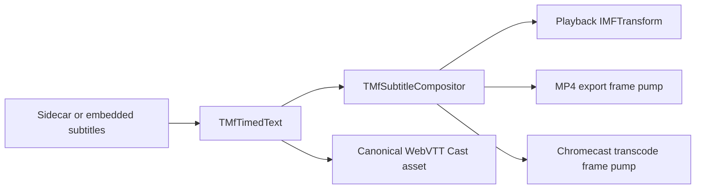
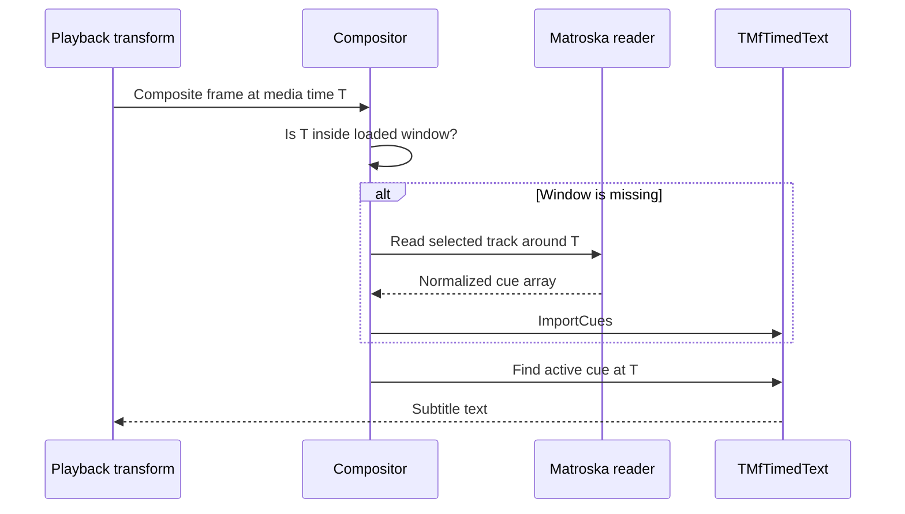
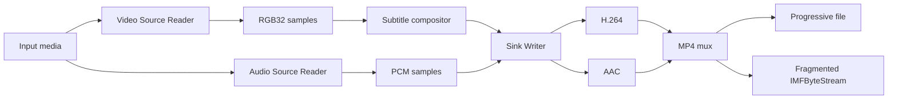
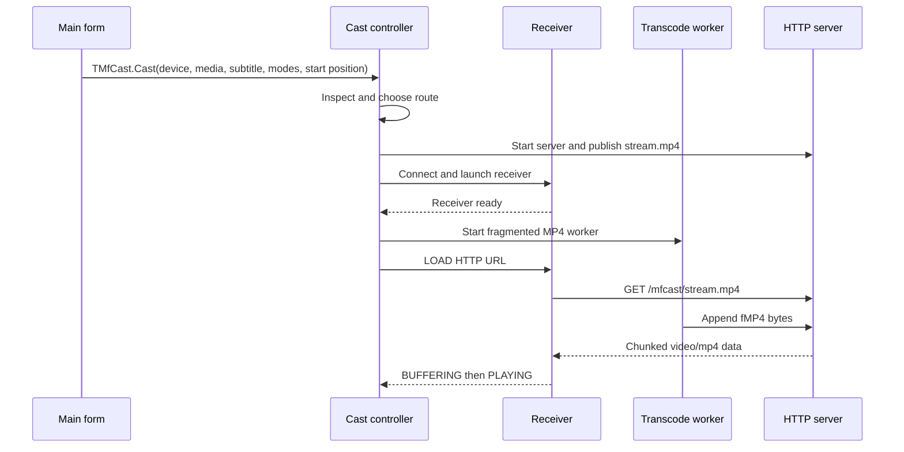

# Sample MfPlayer X2
  
This release is updated for compiler version 17 up to 35.  
SDK version 10.0.22621.4654 (Win 11)  
Requires Windows 10 or later.  
Minimum supported MfPack version: 3.1.5  
  
This document describes the implementation in the current MfPlayer X2 source  
tree. It is intentionally implementation-focused: names, flows, limitations,  
and lifecycle rules should be updated whenever the code changes.  
  
---
  
## 1. Architectural Summary
  
MfPlayer X2 extends the original Media Foundation player sample with a shared  
subtitle pipeline and integrates the reusable MfPack Cast API. Chromecast  
protocol, discovery, transport, HTTP serving, route planning, remuxing, and  
transcoding live under `MfPack\Cast`; they are not implemented inside the  
MfPlayer X2 sample.  
  
The central design decision is that subtitle meaning is independent from its  
destination:  
  

  
The application has five cooperating layers:
  
1. VCL user interface and application lifecycle.
2. Media Foundation Media Session playback.
3. Timed-text discovery, loading, timing, and RGB32 composition.
4. Source Reader and Sink Writer export/transcoding.
5. The reusable `TMfCast` facade for discovery, control, publication, route
   selection, remuxing, and transcoding.
  
---
  
## 2. Source Map
  
### Application and playback
  
| Unit | Responsibility |
|---|---|
| `frmMfPlayer.pas` | Main form, player controls, subtitle selection, export, Cast integration, GUI diagnostics |
| `MfPlayerClassX.pas` | Media Session player, topology construction, stream selection, playback state, subtitle facade |
| `MfMediaTimeline.pas` | Stable subtitle timing from sample timestamps, frame rate, or presentation clock |
| `MFTimerCallBackClass.pas` | Media Foundation timer callback support |
| `MfPCXConstants.pas` | Application messages and shared constants |
| `dlgStreamSelect.pas` | Audio/video stream selection dialog |
| `dlgSelectTimedTextLanguages.pas` | Sidecar and embedded subtitle selection dialog |
  
### Shared subtitle and export pipeline
  
These units are referenced from `MfPack\Cast\Media`. MfPlayer X2 and the Cast
API therefore use the same cue model, compositor, readers, and frame pump.
  
| Unit | Responsibility |
|---|---|
| `LangTags.pas` | Language tags, locale/geography helpers, and sidecar discovery |
| `TimedTextClass.pas` | SubRip, MicroDVD, and WebVTT parsing; normalized cue ownership; WebVTT export |
| `MfMatroskaSubtitleReader.pas` | Direct EBML parsing of Matroska subtitle metadata and cues |
| `MfEmbeddedSubtitleReader.pas` | Container-neutral subtitle track enumeration and cue import |
| `MfSubtitleCompositor.pas` | Subtitle source selection, rolling MKV windows, text rendering, RGB32 blending |
| `MfSubtitleTransform.pas` | Synchronous in-place subtitle `IMFTransform` used by local playback |
| `MfSubtitleFramePump.pas` | Source Reader to compositor to H.264/AAC Sink Writer pipeline |
  
### Chromecast subsystem
  
| Unit | Responsibility |
|---|---|
| `MfPack/Cast/MfCast.pas` | Public `TMfCast` facade used by applications |
| `MfPack/Cast/MfCastTypes.pas` | Public records, settings, states, modes, and callbacks |
| `MfPack/Cast/MfCastInterfaces.pas` | Interfaces between Cast components |
| `MfPack/Cast/MfCastDiscovery.pas` | IPv4 mDNS/DNS-SD discovery of `_googlecast._tcp.local` |
| `MfPack/Cast/MfCastTransport.pas` | TCP and SChannel TLS transport to port 8009 |
| `MfPack/Cast/MfCastProtocol.pas` | Cast V2 envelope/protocol helpers |
| `MfPack/Cast/MfCastChannel.pas` | Receiver launch, persistent control channel, commands, heartbeat, and status parsing |
| `MfPack/Cast/MfCastHttpServer.pas` | Static, ranged, and growing HTTP content publication |
| `MfPack/Cast/MfCastMedia.pas` | Media inspection, capability profile, and route planning |
| `MfPack/Cast/MfCastRemux.pas` | Compatible-source MP4 remux route |
| `MfPack/Cast/MfCastTranscode.pas` | Fragmented MP4 transcode worker |
| `MfPack/Cast/MfCastController.pas` | Internal orchestration, state, rollback, and cleanup |
| `dlgMfCastDevices.pas` | MfPlayer X2 device-selection UI using `TMfCast` |
  
There is no `MfPlayer X2\ChromeCast` implementation directory. The project  
search path points to `MfPack\Cast` and `MfPack\Cast\Media`; the dialog remains  
in the sample root because it is application UI rather than part of the API.  
  
---
  
## 3. Local Playback
  
### 3.1 Open and topology flow
  
`TMfPlayerX.OpenURL` creates a Media Source and Presentation Descriptor, loads  
subtitle metadata, and builds a Media Foundation topology.  
  
Topology construction corrects unreliable source defaults:
  
- unsupported metadata and data streams are deselected;
- a usable audio stream is selected when none was initially selected;
- a usable video stream is selected when none was initially selected;
- only selected audio and video streams receive renderer branches.
  
Audio is connected to the Media Foundation audio renderer. Video is connected  
to the Enhanced Video Renderer (EVR).  
  
When subtitles are active, the video path is:
  

  
Media Foundation may insert the decoder and converter because the topology  
allows decoder insertion around the custom transform.  
  
### 3.2 Player states and requests
  
`TPlayerState` describes the asynchronous Media Session lifecycle, including  
opening, starting, pausing, seeking, stopping, and closing. `TRequest` records  
the command currently being completed.  
  
Media Session callbacks run outside the VCL thread. UI completion is delivered  
through application messages. In particular, `MESessionEnded` posts the final  
playback notification only after queued samples have drained. The form then  
runs `CompletePlayback`.  
  
### 3.3 End-of-playback behavior
  
Natural local completion and receiver `IDLE/FINISHED` both converge on  
`Tfrm_MfPlayer.CompletePlayback`.  
  
That method:
  
- clears pending local/Cast synchronization;
- disconnects an active Cast session;
- stops the Cast transcode worker and HTTP server through controller cleanup;
- stops local playback when it has not already stopped;
- resets controls and progress state.
  
Manual Stop remains a separate explicit-stop path and is not treated as a  
natural end-of-file event.  
  
---
  
## 4. Subtitle Architecture
  
### 4.1 Supported sources
  
The active textual formats are:
  
- SubRip (`.srt`);
- MicroDVD (`.sub`);
- WebVTT (`.vtt`);
- Matroska UTF-8/SRT text;
- Matroska SSA/ASS text.
  
PGS and VobSub tracks can be identified but are not decoded because they are  
bitmap subtitle formats.  
  
The Microsoft MP4 source commonly hides embedded `tx3g`, `wvtt`, and `stpp`  
tracks. Those formats require a dedicated MP4 container adapter and are not  
claimed as supported embedded text in the current implementation.  
  
### 4.2 Sidecar selection
  
`TLanguageTags` discovers matching files and derives language metadata from  
filename conventions and Windows locale information. Geography and locale  
helpers remain available for choosing a suitable default language.  
  
Sidecars are preferred when a supported matching file exists. The language  
dialog combines sidecar choices with enumerated embedded tracks.  
  
### 4.3 Normalized cue ownership
  
`TMfTimedText` is the owner of parsed and imported cues. Container readers do  
not expose a separate rendering model; they normalize cue timestamps and text,  
then call `ImportCues`.  
  
This keeps lookup, rendering, export, and Cast behavior consistent.  
  
WebVTT is validated and exported as UTF-8 with a `WEBVTT` header.  
Cast subtitle assets use WebVTT only.  
  
### 4.4 Matroska metadata and rolling cue loading
  
Matroska track discovery uses a direct EBML metadata pass. This is faster and  
more complete than relying only on a Presentation Descriptor, which may omit  
deselected subtitle tracks.  
  
Selecting an MKV text track does not synchronously import the entire movie.  
The compositor activates an empty timed-text model and fills it on demand:  
  
- 30 seconds of look-behind;
- 5 minutes of look-ahead;
- 30 seconds of cluster overlap while scanning EBML clusters.
  

  
The rolling read currently occurs synchronously at a window boundary.  
It avoids the large startup cost of full extraction, but a slow disk or damaged  
container can still delay the frame that triggers a new window.  
  
### 4.5 Operations requiring a complete cue set
  
`EnsureFullEmbeddedTrack` promotes a rolling MKV track to a complete import  
when an operation needs immutable subtitle bytes. This includes canonical  
WebVTT export used to prepare a Cast subtitle asset.  
  
Consequently:
  
- local MKV playback uses rolling windows;
- normal frame lookup does not preload the entire subtitle track;
- WebVTT export and current Cast preparation can perform a full extraction.
  
### 4.6 Rendering
  
`TMfSubtitleCompositor` resolves the active cue, builds plain display text,  
renders a cached overlay, and blends it into an RGB32 frame. It validates  
dimensions, stride, buffer size, and target rectangle.  
  
`TMfSubtitleVideoTransform` is a narrow synchronous one-input/one-output MFT.  
It stores one sample, composites during `ProcessOutput`, and returns the same  
sample. Optional MFT operations that are irrelevant to this fixed topology may  
return `E_NOTIMPL`.  
  
---
  
## 5. Export and Transcoding
  
`TMfSubtitleFramePump` is shared by file export and Cast transcoding.  
  

  
### File export
  
- produces progressive MP4;
- encodes H.264 video and AAC audio;
- supports video-only sources;
- reports progress;
- supports pause, resume, and cancellation;
- finalizes the Sink Writer when the operation completes or is cancelled after
  frames were written.
  
### Cast transcode
  
- uses an injected growing `IMFByteStream`;
- sets the fragmented MP4 container type;
- uses software video decoding for predictable worker behavior;
- rebases output timestamps to zero after a source seek;
- enables real-time pacing;
- publishes H.264/AAC as one growing `video/mp4` resource.
  
The controller forces `comFragmentedMp4` for the active Cast transcode route,  
even though HLS-oriented settings and enum values still exist.  
  
---
  
## 6. Chromecast Architecture
  
### 6.1 Public facade and ownership
  
MfPlayer X2 creates one `TMfCast` instance with transcoding enabled.  
The form uses only the facade's public operations: discovery, device enumeration,  
`Cast`, play, pause, seek, disconnect, and state queries. It does not construct  
or retain a channel, controller, HTTP server, publisher, remuxer, or transcoder.  
  
The form subscribes to `OnStateChanged`, `OnMediaStatus`, and `OnError`.  
Callbacks can originate outside the VCL thread, so the handlers post private  
window messages and apply all GUI changes on the main thread.  
  
`dlgMfCastDevices.pas` receives the shared `TMfCast` instance, refreshes  
discovery, obtains a device snapshot through `GetDevices`, and returns the  
selected `TMfCastDevice`. The dialog does not own or replace the facade.  
  
### 6.2 Discovery and control channel
  
The API sends an IPv4 mDNS query for `_googlecast._tcp.local`, combines  
PTR/SRV/A/TXT records, and de-duplicates services into physical receiver  
devices. Discovery is independent of receiver connectivity: a powered-down TV  
can remain visible briefly in cached mDNS data, but a Cast attempt will fail  
when the control connection cannot be opened.  
  
The transport connects to port 8009 and performs a native SChannel TLS  
handshake. The channel launches the Default Media Receiver (`CC1AD845`), sends  
namespace-specific JSON in Cast V2 envelopes, and supports LOAD, play, pause,  
stop, seek, volume, mute, and track commands.  
  
After LOAD, a persistent worker reads unsolicited receiver/media status and  
maintains heartbeat PING/PONG traffic. An unexpected read failure, heartbeat  
timeout, receiver close, or powered-down TV is reported to the controller as a  
terminal receiver loss. Requested Stop/Disconnect uses a separate cleanup path  
so it is not misreported as a network error.  
  
### 6.3 Route selection
  
Automatic route planning can choose direct file publication, direct playback  
with an external text track, MP4 remuxing, H.264/AAC transcoding with burned  
subtitles, or the audio-with-artwork route. Selection is based on inspected  
container/codec data, the receiver profile, the requested `TMfCastMediaMode`,  
and `TMfCastSubtitleMode`.  
  
MfPlayer X2 passes `cmmAutomatic` and `csmAutomatic` normally. For MP4 with an  
active subtitle selection it explicitly requests  
`cmmTranscodeBurnedSubtitles` and `csmBurnIntoVideo`. This uses the same proven  
subtitle compositor as local playback and avoids unreliable embedded MP4 text  
track behavior.  
  
### 6.4 Published media
  
Direct files support `GET`, `HEAD`, byte ranges, content length, MIME type, and  
optional CORS headers. External subtitles are published as immutable UTF-8  
WebVTT with a fresh URL token and track identity per load.  
  
Remux and transcode routes publish MP4 through the local HTTP server. The  
transcode route creates the growing resource first and starts production only  
after receiver launch succeeds. Fragmented MP4 bytes are appended to a live  
buffer and streamed to the receiver while the presentation is still growing.  
  

  
### 6.5 Local HTTP address
  
The server binds to `0.0.0.0` and normally requests an ephemeral port. The  
advertised IPv4 address is selected by creating a route toward the chosen  
receiver and querying the resulting local socket address. This avoids exposing  
network configuration in the normal GUI.  
  
### 6.6 Receiver status and application behavior
  
The API converts receiver `MEDIA_STATUS` messages into `TMfCastMediaStatus`  
and state transitions. MfPlayer shows these in `stbCastStatus`; periodic status  
does not rewrite the form caption.  
  
Legitimate `PAUSED` keeps both receiver and local preview paused. A receiver  
loss transitions to `csStopped` or `csError`, cancels pending synchronization  
without resuming it, stops local playback, resets the progress/control state,  
and displays `ChromeCast: Stopped`. Receiver `IDLE/FINISHED` and local  
end-of-file converge on the same complete-playback cleanup.  
  
### 6.7 Firewall diagnostic
  
Cast control is outbound from the PC, but media delivery requires an inbound  
connection from the receiver to the local HTTP server. A common failure is:  
  
- Cast command succeeds;
- receiver remains `BUFFERING`;
- transcode bytes continue accumulating;
- no HTTP request reaches MfPlayer.
  
The HTTP server records accepted requests. If Cast remains buffering for 15  
seconds with zero HTTP requests, the GUI shows a one-time warning explaining  
that Windows Firewall or a Public network profile may be blocking  
`TMFPlayerX2.exe`.  
  
The watchdog stops when a request arrives, playback starts, casting stops, or  
an error occurs. It does not warn for ordinary buffering after the receiver has  
already contacted the server.  
  
---
  
## 7. Cast State and Synchronization
  
The facade exposes the controller state machine:
  
```text
Idle -> Preparing media -> Connecting -> Launching receiver
     -> Connected -> Buffering -> Playing <-> Paused
     -> Stopping/Stopped or Error
```
  
`TMfCast.Cast` can perform connection, inspection, remux/transcode setup, and  
receiver startup, so MfPlayer invokes it through `TMfPlayerCastWorker` instead  
of blocking the VCL thread. The worker passes the selected device, source,  
immutable subtitle asset, requested modes, and the local start position in  
seconds.  
  
The local player continues visibly while the receiver starts. On the first  
Cast `PLAYING` status, the form compares local and receiver positions and seeks  
the local session when required. Transcoded output is rebased to zero, so the  
controller adds the source start offset back to receiver status before updating  
the application timeline.  
  
The local video remains usable if receiver startup fails or takes too long.  
  
---
  
## 8. Threading and Ownership
  
### Main thread
  
- owns VCL controls and dialogs;
- starts subtitle-load and export workers;
- receives player completion messages;
- presents Cast state, errors, and firewall warnings.
  
### Media Foundation callback threads
  
- deliver Media Session events;
- update player state;
- post UI notifications instead of directly running completion UI.
  
### Subtitle-load worker
  
- imports selected non-rolling tracks away from the VCL thread;
- supports cancellation and serial numbers so stale results are ignored.
  
### Export and Cast workers
  
- initialize COM for the worker thread;
- keep the potentially slow `TMfCast.Cast` operation off the VCL thread;
- own their compositor and frame pump;
- observe pause/cancel state;
- complete or abort their publisher before release.
  
### HTTP server thread
  
- accepts receiver connections;
- parses one request at a time;
- streams static or growing content;
- is released by closing both listening and active client sockets.
  
Live buffers, HTTP content, byte streams, publishers, and controller components  
are interface-owned. Cleanup aborts the publisher before waiting for the  
transcode worker, ensuring a blocked byte-stream write can exit.  
  
---
  
## 9. Failure and Cleanup Rules  
  
Cast setup is transactional. `FailCastAttempt` converts semantic failure such  
as `S_FALSE` into an actual failure code, tears down partial work, reports the   
stage, and leaves the controller in a recoverable state.  
  
Cleanup order matters:
  
1. Stop the receiver while its session and media URL are still valid.
2. Abort the live publisher to release blocked writes.
3. Stop and join the transcode worker.
4. Unpublish subtitle and media resources.
5. Stop the HTTP server and close the client socket.
6. Disconnect the Cast control channel.
7. Clear pending and active request records.
  
Repeated casting after an offline receiver or failed load must not reuse an old  
publisher, URL, media session, or worker.  
  
---
  
## 10. Current Boundaries
  
The following limitations are intentional or not yet completed:
  
- Media inspection and the default capability profile remain optimistic; a
  compatible extension/MIME type does not prove codec compatibility.
- The persistent control worker is single-channel; commands and unsolicited
  status still share one serialized Cast connection.
- The HTTP server handles clients serially rather than through a worker pool.
- Incomplete live MP4 uses HTTP chunked transfer; receiver support can vary.
- HLS settings and output mode exist, but no complete playlist and segment
  publisher is active.
- HTTP TLS is not implemented.
- Resource-token and maximum-connection settings are ahead of the concrete
  server implementation.
- Cast control TLS peer verification is disabled by default.
- Discovery is IPv4 only.
- Runtime switching among multiple Cast text tracks is not implemented.
- Bitmap subtitles such as PGS and VobSub are not decoded.
- Embedded MP4 text requires a dedicated container adapter.
- Full WebVTT asset export currently promotes a rolling MKV track to a complete
  import before Cast startup.
  
The trust model is a private local network. Media URLs are plain HTTP and must  
be reachable from the receiver.  
  
---
  
## 11. Diagnostics
  
Useful debug markers include:
  
```text
Embedded subtitle refresh
MfCast WebVTT cue
MfCast TRANSCODE URL
MfCast Transcode: worker started
Export: first ReadSample
Export: before WriteSample
MfCast live buffer bytes
MfCast HTTP request
MfCast HTTP live chunked start
MfCast MEDIA_STATUS
MfCast receiver STOP
```
  
Interpretation of a typical live Cast attempt:
  
- advancing frame counts prove decoding and encoding are active;
- increasing live-buffer bytes prove the Sink Writer is producing fMP4;
- an HTTP request proves the receiver can reach the PC;
- `BUFFERING` without any HTTP request points to firewall or network isolation;
- `PLAYING` confirms receiver demux, decode, and startup;
- `IDLE/FINISHED` triggers complete local and Cast teardown.
  
Errors should include both the hexadecimal HRESULT and the operation stage.
  
---
  
## 12. Build and Runtime Requirements
  
- Windows 10 version 1703 or later, or Windows 11.
- Delphi with the MfPack units configured; current source headers target
  compiler versions 23 through 35.
- Windows SDK 10.0.26100.4654.
- Media Foundation decoders for the source format.
- H.264 and AAC encoders for export and transcoded Cast playback.
- Receiver and PC on a mutually reachable local network.
- Windows Firewall permission for the application on the active network
  profile.
  
Open `TMFPlayerX2.dproj`, select Win32, and build from the Delphi IDE. The  
project also builds through MSBuild after loading the Delphi environment with  
`rsvars.bat`.  
  
---
  
## 13. Regression Checklist
  
### Local playback
  
- audio/video, video-only, and audio-only sources;
- play, pause, resume, seek, rate, stop, and natural completion;
- close during opening, playback, seek, and shutdown;
- verify that natural completion also disconnects an active Cast session.
  
### Subtitles
  
- SRT, MicroDVD, and WebVTT sidecars;
- MKV UTF-8/SRT and SSA/ASS tracks;
- multiple languages and asynchronous selection;
- rolling-window transition and seek to a distant timestamp;
- malformed WebVTT header;
- PGS/VobSub reported as unsupported rather than parsed as text.
  
### Export
  
- H.264/AAC output and video-only output;
- pause, resume, cancel, and finalization;
- long-duration A/V synchronization;
- VLC playback of the resulting MP4 with burned subtitles.
  
### Chromecast
  
- direct file and range requests;
- external WebVTT text track;
- burned-subtitle fragmented MP4;
- start from a nonzero local position;
- pause, resume, seek, stop, and natural completion;
- repeated Cast attempts after failure;
- receiver powered off or disconnected;
- Public network/firewall block and the 15-second GUI warning;
- application close during live transcode;
- verify that no worker, listening socket, or stale URL remains.
  
---
  
## 14. Architectural Invariants
  
When modifying the application, preserve these rules:
  
1. `TMfTimedText` remains the normalized cue owner.
2. Container readers return normalized cues and do not render subtitles.
3. Playback, export, and Cast burn-in share `TMfSubtitleCompositor`.
4. Cast networking receives immutable subtitle bytes, not live player objects.
5. Rolling MKV reads are used for ordinary playback; complete export is
   explicit.
6. VCL controls are touched only from the main thread.
7. Publisher abort precedes worker join during teardown.
8. A failed Cast attempt leaves no worker, resource, socket, or stale request.
9. Local or receiver end-of-file tears down both sides of an active Cast.
10. User-facing networking remains automatic, with actionable diagnostics when
    automatic setup is blocked.
  
---
  
## 15. Final Perspective
  
MfPlayer X2 is a compact reference for joining Media Foundation playback,  
timed text, frame composition, MP4 encoding, and Google Cast without duplicating  
subtitle logic.  
  
The subtitle parser decides what text is active. The timeline decides when it  
is active. The compositor decides how it becomes pixels. The playback MFT,  
file exporter, and Cast transcoder decide where those pixels go.  
  
The reusable Cast subsystem follows the same separation: `TMfCast` is the  
application facade, while discovery, transport, protocol, HTTP publication,  
media planning, remuxing, transcoding, and controller orchestration remain  
internal components. MfPlayer X2 adds only application policy, device UI,  
local-preview synchronization, and VCL-safe event handling.  
  
That separation is the main architectural asset. Future work should strengthen  
capability inspection, HTTP concurrency and security, and incremental subtitle  
loading without weakening the shared cue and compositor model.  
  
Project: Media Foundation - MFPack - Samples  
Project location: http://sourceforge.net/projects/MFPack  
  
First release date: 01-02-2022  
Final release date: 05/05/2026  
  
Copyright © FactoryX. All rights reserved.  

